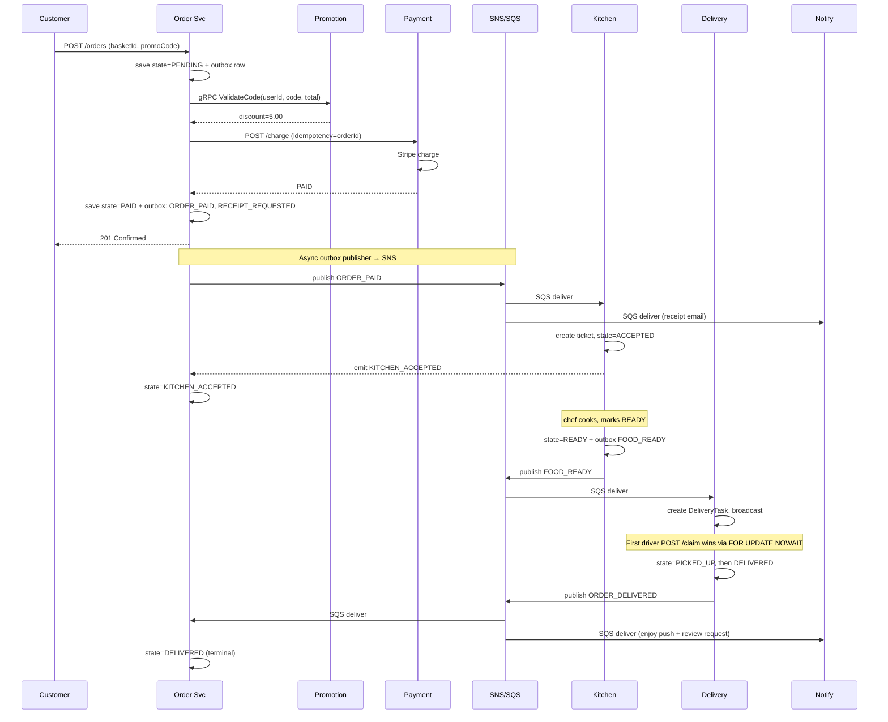
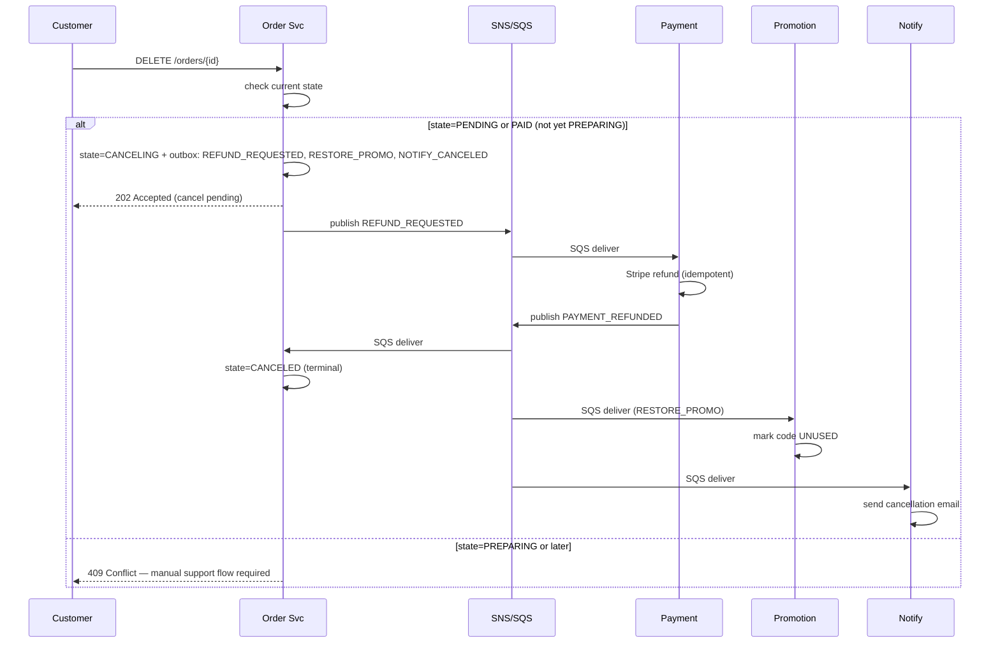
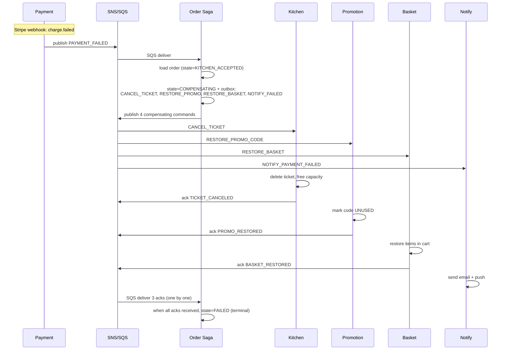
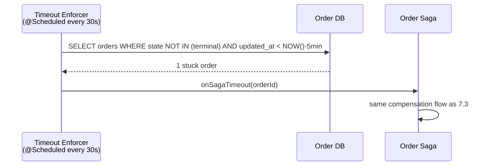

# Food Ordering System — Architecture Reference

> **Purpose**: This is the architecture and design reference for a production-grade food ordering microservices platform on AWS. It describes *what* you're building and *why* the choices were made — not *how* to build it step-by-step.
>
> The companion document **`build-plan.md`** contains the 85 build steps that turn this architecture into running code. Read this document once for context, then re-consult specific sections from individual build steps as needed.

---

## How to Use This Document

This is a reference, not an action plan. Read it in order on first pass to understand the system. After that, jump to specific sections as build steps reference them. **Section 4** (Resilience Patterns), **Section 5** (Data Design), **Section 8** (Saga & Outbox), and **Section 10** (CI/CD Pipeline) are the most-cross-referenced sections from the build plan — keep them handy.

The architectural decisions documented here are **fixed for the platform**. If you want to change one (different DB, different messaging, etc.), update this document first, then propagate the change through `build-plan.md`. Don't make architectural changes inside individual build steps.

---

## Table of Contents

1. [High-Level Architecture Overview](#1-high-level-architecture-overview)
2. [Service Responsibilities & Interaction Design](#2-service-responsibilities--interaction-design)
3. [AWS Service Mapping](#3-aws-service-mapping)
4. [Resilience Patterns Per Service](#4-resilience-patterns-per-service)
5. [Data Design Decisions](#5-data-design-decisions)
6. [Implementation Roadmap](#6-implementation-roadmap)
7. [Order Flow in Detail](#7-order-flow-in-detail)
8. [Saga & Outbox Pattern in Order Service](#8-saga--outbox-pattern-in-order-service)
9. [Key Best Practices by Category](#9-key-best-practices-by-category)
10. [CI/CD Pipeline (AWS Native)](#10-cicd-pipeline-aws-native)

---

# PART A — REFERENCE DOCUMENTATION

## 1. High-Level Architecture Overview

The system is split into ten microservices organized by domain. All services run on EKS Fargate except Notification, which runs as Lambda for cost efficiency. Three communication mechanisms run between services: REST/HTTP through API Gateway, gRPC for internal synchronous calls where latency matters, and asynchronous events for everything that doesn't need an immediate response. The async layer is **hybrid**: Amazon MSK (managed Kafka) for the domain-event backbone where replay value matters, and SNS/SQS for simpler patterns (Lambda triggers, webhook intake, point-to-point queues).

```
                       ┌─────────────────────────────────────┐
                       │              CLIENTS                │
                       │  Customer App · Restaurant POS ·    │
                       │           Driver App                │
                       └─────────────────┬───────────────────┘
                                         │
                       ┌─────────────────▼───────────────────┐
                       │       API GATEWAY + ALB             │
                       │  JWT validation · Rate limiting ·   │
                       │            WAF · Routing            │
                       └─────────────────┬───────────────────┘
                                         │
   ┌─────────────────────────────────────┼─────────────────────────────────────┐
   │                                     │                                     │
   │     EDGE TIER (customer-facing)     │                                     │
   │  ┌─────────────┐ ┌─────────────┐ ┌─────────────┐                          │
   │  │  Identity   │ │ Restaurant  │ │   Basket    │                          │
   │  │ & Profile   │ │    Menu     │ │   (Cart)    │                          │
   │  └─────────────┘ └─────────────┘ └─────────────┘                          │
   │                                                                           │
   │     CORE TIER (transaction processing)                                    │
   │  ┌─────────────┐ ┌─────────────┐ ┌─────────────┐                          │
   │  │    Order    │ │   Payment   │ │  Promotion  │                          │
   │  │ Orchestrator│ │             │ │  & Loyalty  │                          │
   │  └─────────────┘ └─────────────┘ └─────────────┘                          │
   │                                                                           │
   │     FULFILLMENT TIER                                                      │
   │  ┌─────────────┐ ┌─────────────┐ ┌─────────────┐                          │
   │  │   Kitchen   │ │  Delivery   │ │   Review    │                          │
   │  │             │ │  (Dispatch) │ │ & Feedback  │                          │
   │  └─────────────┘ └─────────────┘ └─────────────┘                          │
   │                                                                           │
   │     COMMUNICATION HUB                                                     │
   │  ┌───────────────────────────────┐                                        │
   │  │   Notification (AWS Lambda)   │                                        │
   │  │   SES email · SNS Mobile Push │                                        │
   │  └───────────────────────────────┘                                        │
   └─────────────────────────────────────┬─────────────────────────────────────┘
                                         │
   ┌─────────────────────────────────────▼─────────────────────────────────────┐
   │                          ASYNC MESSAGING LAYER                            │
   │  ┌──────────────────────────────────┐  ┌──────────────────────────────┐   │
   │  │    Amazon MSK (Kafka)            │  │       SNS + SQS              │   │
   │  │    Domain event backbone         │  │   Lambda triggers,           │   │
   │  │    (replay-capable)              │  │   webhook intake,            │   │
   │  │                                  │  │   simple fan-out             │   │
   │  │  Topics:                         │  │                              │   │
   │  │   identity-events                │  │  Used by:                    │   │
   │  │   order-events                   │  │   Notification Lambda inbox  │   │
   │  │   payment-events                 │  │   Stripe webhook intake      │   │
   │  │   kitchen-events                 │  │   Compensation commands      │   │
   │  │   delivery-events                │  │   (point-to-point)           │   │
   │  │   driver-status                  │  │                              │   │
   │  │   (keyed by driverId)            │  │                              │   │
   │  └──────────────────────────────────┘  └──────────────────────────────┘   │
   │       Both fed by service Outbox publishers (Postgres outbox or DDB       │
   │       Streams). Notification Lambda triggers from MSK topics.             │
   └─────────────────────────────────────┬─────────────────────────────────────┘
                                         │
   ┌─────────────────────────────────────┼─────────────────────────────────────┐
   │                                     │     DATA TIER (polyglot)            │
   │  ┌──────────────────────┐  ┌──────────────────────┐                       │
   │  │  RDS Aurora          │  │  DynamoDB            │                       │
   │  │  PostgreSQL          │  │  Menu, Kitchen,      │                       │
   │  │  Identity, Order,    │  │  Payment, Review,    │                       │
   │  │  Promotion, Delivery │  │  Idempotency keys    │                       │
   │  └──────────────────────┘  └──────────────────────┘                       │
   │  ┌──────────────────────┐  ┌──────────────────────┐                       │
   │  │  ElastiCache Redis   │  │  S3 + CloudFront     │                       │
   │  │  Basket, Menu cache, │  │  Menu images,        │                       │
   │  │  Sessions, Limits    │  │  Templates, Receipts │                       │
   │  └──────────────────────┘  └──────────────────────┘                       │
   └───────────────────────────────────────────────────────────────────────────┘
```

### Communication Patterns Summary

| Pattern | When to Use | Examples |
|---|---|---|
| REST (sync, public) | Client → API Gateway | All public APIs |
| gRPC (sync, internal) | Service → Service when latency matters | Basket → Menu (verify dish), Order → Promotion (validate code) |
| **Kafka topic (async, replay-capable)** | **Domain events that other services react to and that may need to be replayed** | `USER_CREATED`, `ORDER_PAID`, `FOOD_READY`, `ORDER_DELIVERED`, `PAYMENT_SUCCESS/FAILED` |
| **Kafka topic (keyed for ordering)** | **Strict per-key ordering at scale** | Driver status updates keyed by `driverId` (replaces SQS FIFO) |
| **SNS + SQS** | **Lambda triggers, webhook intake, simple fan-out where replay isn't needed** | Notification Lambda *can* also subscribe directly to MSK; SQS is used for Stripe webhook intake and compensation commands |

### When Kafka vs SNS/SQS

This plan uses Kafka (Amazon MSK) for **domain events**, defined as: facts about something that happened in the system that other services may want to react to, **and** where the ability to replay history (rebuild a downstream service's state, add a new consumer later, audit what happened) has real value.

It uses SNS/SQS for:
- **Stripe webhook intake** — public HTTP endpoint posts to SNS → SQS → Payment service. Simple, no replay value.
- **Saga compensation commands** — point-to-point messages where Order Orchestrator tells Kitchen to cancel a ticket. Commands are time-bound; replay would be wrong.
- **Internal queue patterns** — anywhere we want at-least-once delivery to a single consumer with a DLQ but no fan-out.

Notification Lambda has its own topic subscriptions (Lambda has native MSK event source support), so it pulls receipt requests, welcome emails, and "enjoy" pushes directly from Kafka.

---

## 2. Service Responsibilities & Interaction Design

### 2.1 Identity & Profile Service

**Role**: Manages three user personas (Customer, Restaurant, Driver) and their roles.

**Logic**: On registration it writes the user record and a `USER_CREATED` event to the outbox in the same database transaction. JWT tokens are signed with RS256 and carry custom claims (`role`, `restaurantId`, `driverId`) so downstream services authorize without callbacks. Other services validate the JWT signature locally using the public key cached from Parameter Store. Login issues short-lived access tokens (15 min) plus refresh tokens (30 days) stored in Redis.

**AWS**: EKS Fargate in private subnet. RDS PostgreSQL with read replica for non-auth queries.

**Key endpoints**:
- `POST /v1/auth/register` (public)
- `POST /v1/auth/login` (public)
- `POST /v1/auth/refresh` (public)
- `GET /v1/users/me` (authenticated)
- `PATCH /v1/users/me` (authenticated)

### 2.2 Restaurant Menu Service

**Role**: The "Digital Menu" for all restaurants.

**Logic**: Read-heavy service with a 1000:1 read/write ratio. Cache-aside with Redis: read tries cache first, falls through to DynamoDB on miss, populates cache with 30-minute TTL. Writes (price changes, new dishes) update DynamoDB then explicitly purge affected Redis keys. Supports menu schedules (breakfast 06:00–11:00, dinner 17:00–22:00). Exposes a gRPC endpoint for Basket and Order services to verify dish availability and current price in real time. Subscribes to `RESTAURANT_PAUSED` events from Kitchen Service and hides the restaurant from search results.

**AWS**: EKS Fargate. DynamoDB for flexible menu schemas. ElastiCache Redis for performance. S3 + CloudFront for menu item images.

**Key endpoints**:
- `GET /v1/restaurants/{id}/menu` (public, cached)
- `GET /v1/restaurants/search?q=...&cuisine=...` (public)
- `POST /v1/restaurants/{id}/menu/items` (restaurant-owner authenticated)
- `gRPC MenuService.VerifyItem(restaurantId, itemId)` (internal)

### 2.3 Basket (Cart) Service

**Role**: Real-time intent storage for items a user is considering.

**Logic**: Carts are stored as Redis hashes keyed by `userId`. Each "Add to basket" request includes an idempotency key (UUID generated client-side) — duplicate requests with the same key return the prior result. Before adding an item it makes a gRPC call to Menu Service to confirm the dish is still active and the price is current. Carts auto-expire after 24 hours via Redis TTL. On checkout the cart is locked and converted into an order request.

**AWS**: EKS Fargate. ElastiCache Redis (Cluster Mode) as primary store.

**Key endpoints**:
- `GET /v1/basket` (authenticated)
- `POST /v1/basket/items` (authenticated, idempotency-key required)
- `DELETE /v1/basket/items/{itemId}` (authenticated)
- `POST /v1/basket/checkout` (authenticated)

### 2.4 Order Orchestrator Service

**Role**: The Saga Leader and order state manager. The most important service in the system.

**Logic**: Owns the order state machine (`PENDING → PAID → KITCHEN_ACCEPTED → FOOD_READY → OUT_FOR_DELIVERY → DELIVERED`). Manages the Transactional Outbox to ensure commands reach Kitchen, Payment, and Delivery services reliably. Every state transition writes the new state plus the next saga command(s) to the outbox in one transaction. A scheduled `SagaTimeoutEnforcer` catches stuck orders (no progress in 5 minutes) and triggers compensation. It is the only service authorized to issue compensating transactions (refund, restore promo code, cancel ticket).

**AWS**: EKS Fargate. RDS PostgreSQL for transactional integrity (orders + outbox in same DB).

**Key endpoints**:
- `POST /v1/orders` (authenticated, from basket checkout)
- `GET /v1/orders/{id}` (authenticated)
- `GET /v1/orders` (authenticated, paginated)
- `DELETE /v1/orders/{id}` (authenticated, conditional on state)

### 2.5 Kitchen Service

**Role**: Restaurant operations and capacity management.

**Logic**: Doesn't track ingredients but tracks kitchen capacity. When a restaurant has too many "Preparing" orders (configurable per restaurant), it publishes a `RESTAURANT_PAUSED` event that Menu Service consumes to hide that restaurant from search. Manages ticket lifecycle: `ACCEPTED → PREPARING → READY_FOR_PICKUP`. When the chef marks a ticket "Ready," it writes a `FOOD_READY` event to its outbox so Delivery Service knows to pick up.

**AWS**: EKS Fargate. DynamoDB to track active tickets per restaurant.

**Key endpoints**:
- `GET /v1/restaurants/{id}/tickets` (restaurant-owner authenticated)
- `PATCH /v1/tickets/{id}/status` (restaurant-owner authenticated)

### 2.6 Payment Service

**Role**: Secure financial interface — proxy to external payment gateways.

**Logic**: Strictly idempotent — every charge request requires an `idempotency_key` (the order ID). Before calling Stripe it checks DynamoDB for that key; if found, returns the prior result without re-charging. The DynamoDB ledger is append-only and serves as the source of truth for financial reconciliation. Listens for Stripe webhooks (charge succeeded, failed, disputed) and emits `PAYMENT_SUCCESS`, `PAYMENT_FAILED` events. Implements circuit breaker, retry with exponential backoff, and rate limiter on Stripe API calls.

**AWS**: EKS Fargate in dedicated private subnet (stricter SGs). DynamoDB for immutable transaction ledger.

**Key endpoints**:
- `POST /v1/payments/charge` (internal, called by Order Orchestrator)
- `POST /v1/payments/refund` (internal)
- `POST /v1/webhooks/stripe` (public, Stripe webhook signature verified)

### 2.7 Promotion & Loyalty Service

**Role**: Rules engine for discounts and growth.

**Logic**: Three responsibilities:
1. **First-Time Discount**: Listens for `USER_CREATED` events and automatically issues a "Welcome" promo code via Notification service.
2. **Tiered Rewards**: Checks order totals (e.g., > $50 → "Free Delivery").
3. **Validation**: Receives gRPC requests from Order Orchestrator at checkout to validate codes and compute discount amounts.

Uses a unique constraint `(userId, codeType)` to prevent duplicate issuance under retries. Tracks code state: `ISSUED → USED → EXPIRED`.

**AWS**: EKS Fargate. RDS PostgreSQL for promo state with strong consistency.

**Key endpoints**:
- `gRPC PromotionService.ValidateCode(userId, code, orderAmount)` (internal)
- `gRPC PromotionService.RedeemCode(userId, code, orderId)` (internal)
- `gRPC PromotionService.RestoreCode(userId, code)` (internal, for compensation)

### 2.8 Delivery (Dispatch) Service

**Role**: Simplified job board for couriers.

**Logic**: Once an order is paid (consumes `FOOD_READY` event), it creates a `DeliveryTask` and broadcasts via SNS Mobile Push to active drivers. The first driver to call `POST /tasks/{id}/claim` wins via PostgreSQL row-level locking (`SELECT … FOR UPDATE NOWAIT`) — losers receive `409 Conflict`. Status updates flow through SQS FIFO with `MessageGroupId = driverId` to guarantee ordering per driver. Transitions: `BROADCAST → ASSIGNED → PICKED_UP → DELIVERED`. No GPS tracking in v1.

**AWS**: EKS Fargate. RDS PostgreSQL for task state. SQS FIFO for driver status updates.

**Key endpoints**:
- `POST /v1/delivery/tasks/{id}/claim` (driver authenticated)
- `PATCH /v1/delivery/tasks/{id}/status` (driver authenticated)
- `GET /v1/delivery/tasks/available` (driver authenticated)

### 2.9 Review & Feedback Service

**Role**: Social proof and quality control.

**Logic**: Multi-entity feedback — users review the Restaurant, the Driver, and specific Meals separately. Flexible NoSQL schema accommodates different rating shapes. DynamoDB partition key is `REVIEW#{type}#{entityId}` (where `type` is `RESTAURANT`, `DRIVER`, or `MEAL`). A DynamoDB Stream-triggered Lambda updates a separate aggregate counters table for read efficiency (avg rating, count). Subscribes to `ORDER_DELIVERED` events to open the review window for that order; auto-closes after 7 days.

**AWS**: EKS Fargate. DynamoDB for ratings + DynamoDB Streams + Lambda for aggregation.

**Key endpoints**:
- `POST /v1/reviews` (customer authenticated)
- `GET /v1/restaurants/{id}/reviews` (public, paginated)
- `GET /v1/drivers/{id}/reviews` (driver/admin authenticated)

### 2.10 Notification Service

**Role**: Asynchronous communication hub.

**Logic**: Triggered solely by SQS messages — no synchronous API surface. The Lambda fetches a Mustache template from S3 (versioned by template ID), renders it with the event payload, and sends via SES (email) or SNS Mobile Push (FCM/APNS). Failed sends go to a dead-letter queue with a CloudWatch alarm. Idempotent: deduplicates on `(eventId, channel, recipient)` using DynamoDB conditional writes with TTL.

**AWS**: AWS Lambda (cost-efficient). Triggered by SQS. SES for email. SNS Mobile Push. S3 for templates. DynamoDB for idempotency.

**Triggers consumed**:
- `USER_CREATED` → welcome email
- `ORDER_PAID` → receipt email
- `FOOD_READY` → "Your food is on the way" push
- `ORDER_DELIVERED` → "Enjoy" push + review request
- `PAYMENT_FAILED` → payment failure email + retry link

---

## 3. AWS Service Mapping

This section provides a service-by-service breakdown of every AWS resource you will provision.

### 3.1 Identity & Profile Service
| Concern | AWS Service | Notes |
|---|---|---|
| Compute | EKS Fargate (private subnet) | 2+ replicas, HPA on CPU 70% |
| Primary database | RDS Aurora PostgreSQL | Multi-AZ, 1 read replica |
| Cache (refresh tokens, JWT public key) | ElastiCache Redis | Shared cluster |
| Secret management | Secrets Manager | DB credentials, JWT private key |
| Public key distribution | SSM Parameter Store | JWT public key, 1-day TTL |
| Outbox publisher | EKS sidecar (Spring scheduler) | Polls every 500ms, publishes to Kafka |
| **Event publishing** | **Amazon MSK topic `identity-events`** | **Replay-capable, partitioned by `userId`** |
| Logs | CloudWatch Logs via Fluent Bit | 30-day retention |
| Metrics | Amazon Managed Prometheus | Scrapes Spring Actuator |
| Tracing | AWS X-Ray | OTel SDK auto-instrumentation |
| IAM | IRSA role (read SSM, write to MSK, read Secrets) | Least privilege |

### 3.2 Restaurant Menu Service
| Concern | AWS Service | Notes |
|---|---|---|
| Compute | EKS Fargate | 3+ replicas, autoscale on RPS |
| Primary store | DynamoDB `menus` table | On-demand billing |
| Image storage | S3 bucket `menu-images-{env}` | Versioning enabled |
| Image CDN | CloudFront distribution | 24-hour cache |
| Cache layer | ElastiCache Redis | Cluster Mode, 30-min TTL |
| Search backing | OpenSearch (optional, Phase 5+) | Synced via DDB Streams |
| Internal API | gRPC over HTTP/2 on ALB | Internal only |
| **Event consumption** | **MSK consumer for `kitchen-events` topic** | **For `RESTAURANT_PAUSED`/`RESTAURANT_RESUMED`** |
| IAM | IRSA (DDB read/write, S3 read, Redis access, MSK consume) | |

### 3.3 Basket Service
| Concern | AWS Service | Notes |
|---|---|---|
| Compute | EKS Fargate | 3+ replicas |
| Primary store | ElastiCache Redis (Cluster Mode) | TTL 24h, hash per cart |
| Idempotency keys | ElastiCache Redis | Same cluster, prefix `idem:` |
| Internal client | gRPC client to Menu Service | Resilience4j wrapped |
| Compensation consumption | SQS `basket-compensation` queue | For `RESTORE_BASKET` from Order |
| IAM | IRSA (Redis access, ALB, SQS consume) | |

### 3.4 Order Orchestrator Service
| Concern | AWS Service | Notes |
|---|---|---|
| Compute | EKS Fargate | 4+ replicas (highest criticality) |
| Primary database | RDS Aurora PostgreSQL | Multi-AZ, 2 read replicas |
| Outbox table | Same Aurora DB | Indexed on `(processed_at, created_at)` |
| Outbox publisher | EKS sidecar with `SELECT FOR UPDATE SKIP LOCKED` | Multiple instances safe; publishes to Kafka |
| **Event publishing** | **MSK topic `order-events`** | **Partitioned by `orderId` for per-order ordering** |
| **Event consumption** | **MSK consumer groups for `payment-events`, `kitchen-events`, `delivery-events`** | **One consumer group per source topic** |
| Compensation commands | SQS queues (`kitchen-compensation`, `promotion-compensation`, `basket-compensation`) | Point-to-point; no replay value |
| Internal calls | gRPC to Promotion Service | Synchronous validation |
| Saga timeout | Spring scheduled task + DB query | Every 30s |
| IAM | IRSA (DB, MSK produce/consume, SQS publish/consume, gRPC) | |

### 3.5 Kitchen Service
| Concern | AWS Service | Notes |
|---|---|---|
| Compute | EKS Fargate | 2+ replicas |
| Primary store | DynamoDB `tickets` table | PK = restaurantId, SK = ticketId |
| Capacity counter | DynamoDB atomic counter | `ADD active_tickets 1` |
| Outbox | DynamoDB `outbox-kitchen` table with TTL | Stream-triggered Lambda publisher |
| **Event consumption** | **MSK consumer for `order-events`** | **For `ORDER_PAID`** |
| Compensation consumption | SQS `kitchen-compensation` queue | For `CANCEL_KITCHEN_TICKET` from Order |
| **Event publishing** | **MSK topic `kitchen-events`** | **`FOOD_READY`, `RESTAURANT_PAUSED`, `RESTAURANT_RESUMED`** |
| IAM | IRSA (DDB read/write, MSK produce/consume, SQS consume) | |

### 3.6 Payment Service
| Concern | AWS Service | Notes |
|---|---|---|
| Compute | EKS Fargate (dedicated subnet, stricter SG) | 3+ replicas |
| Primary store | DynamoDB `payment-ledger` table | Append-only, PIT recovery on |
| Idempotency index | DynamoDB GSI on `idempotency_key` | Lookup before charge |
| Stripe API key | Secrets Manager | Auto-rotation via Stripe API |
| **Webhook intake** | **API Gateway → SQS → Service** | **Public endpoint, signature verified, SQS for buffering** |
| **Event publishing** | **MSK topic `payment-events`** | **`PAYMENT_SUCCESS`, `PAYMENT_FAILED`, `PAYMENT_REFUNDED`** |
| Refund command consumption | SQS `payment-refund` queue | Compensation command from Order |
| Circuit breaker state | In-memory Resilience4j | Per pod |
| Outbound NAT | NAT Gateway (Stripe API) | One per AZ |
| IAM | IRSA (DDB, MSK produce, SQS consume, Secrets, KMS) | |

### 3.7 Promotion & Loyalty Service
| Concern | AWS Service | Notes |
|---|---|---|
| Compute | EKS Fargate | 2+ replicas |
| Primary database | RDS Aurora PostgreSQL | Shared cluster with Identity (different DB) |
| Internal API | gRPC over HTTP/2 on ALB | Internal only |
| **Event consumption** | **MSK consumer for `identity-events`** | **For `USER_CREATED`** |
| Compensation consumption | SQS `promotion-compensation` queue | For `RESTORE_PROMO_CODE` (point-to-point command) |
| **Event publishing** | **MSK topic `promotion-events`** | **`PROMO_ISSUED`, `PROMO_REDEEMED`** |
| Outbox | Same Aurora DB | For Kafka publisher sidecar |
| IAM | IRSA (DB, MSK produce/consume, SQS consume) | |

### 3.8 Delivery Service
| Concern | AWS Service | Notes |
|---|---|---|
| Compute | EKS Fargate | 2+ replicas |
| Primary database | RDS Aurora PostgreSQL | Shared cluster, separate DB |
| Driver broadcast | SNS Mobile Push | FCM/APNS for driver app |
| **Driver status updates** | **MSK topic `driver-status` (keyed by `driverId`)** | **Per-driver ordering at scale; replaces SQS FIFO** |
| **Event consumption** | **MSK consumer for `kitchen-events`** | **For `FOOD_READY`** |
| Compensation consumption | SQS `delivery-compensation` queue | For `RELEASE_DRIVER` from Order |
| **Event publishing** | **MSK topic `delivery-events`** | **`DELIVERY_ASSIGNED`, `ORDER_DELIVERED`, `DELIVERY_FAILED`** |
| Outbox | Same Aurora DB | For Kafka publisher sidecar |
| IAM | IRSA (DB, MSK produce/consume, SQS consume, SNS Mobile Push) | |

### 3.9 Review & Feedback Service
| Concern | AWS Service | Notes |
|---|---|---|
| Compute | EKS Fargate | 2+ replicas |
| Primary store | DynamoDB `reviews` table | PK = `REVIEW#{type}#{entityId}` |
| Aggregations | DynamoDB `review-aggregates` table | Updated by Stream Lambda |
| **Event consumption** | **MSK consumer for `delivery-events`** | **For `ORDER_DELIVERED`** |
| Aggregation Lambda | AWS Lambda + DDB Streams | Computes avg, count |
| IAM | IRSA + Lambda role | |

### 3.10 Notification Service
| Concern | AWS Service | Notes |
|---|---|---|
| Compute | AWS Lambda | **Java 25 runtime (Corretto), 512 MB** |
| **Primary triggers** | **Lambda MSK event source mappings** | **Native Lambda → MSK integration; one event source per topic** |
| Webhook-style triggers | SQS event source | For Stripe webhook → email-receipt edge cases |
| Templates | S3 bucket `notification-templates-{env}` | Versioned, KMS-encrypted |
| Email | Amazon SES | Verified domain, dedicated IP pool |
| Push | SNS Mobile Push (FCM/APNS) | Platform applications per app |
| Idempotency | DynamoDB `notification-idempotency` | TTL 7 days |
| Dead-letter | Lambda DLQ (SQS) + CloudWatch alarm on depth | |
| IAM | Lambda execution role (MSK consume, SES send, SNS publish, S3 read, DDB) | |

---

## 4. Resilience Patterns Per Service

A clean per-service list. For implementation guidance, see **`build-plan.md` Phase 1 Step 1.3** (shared Resilience4j configurations in the `common-resilience` module) and **`build-plan.md` Phase 8 Step 8.6** (saga compensation logic in the Order Orchestrator).

- **Identity & Profile Service**: Rate Limiter, Timeout, Retry, Bulkhead
- **Restaurant Menu Service**: Cache-Aside, Timeout, Bulkhead, Rate Limiter
- **Basket Service**: Idempotency Key, Timeout, Retry, Circuit Breaker (gRPC → Menu)
- **Order Orchestrator Service**: Saga, Outbox, Circuit Breaker, Retry, Timeout, Bulkhead, Compensating Transactions, Saga Timeout Enforcer
- **Kitchen Service**: Outbox, Idempotency Key, Retry, Timeout
- **Payment Service**: Idempotency Key, Circuit Breaker, Retry with Exponential Backoff, Timeout, Bulkhead, Rate Limiter
- **Promotion & Loyalty Service**: Circuit Breaker, Timeout, Retry, Idempotency Key
- **Delivery Service**: Outbox, Optimistic Locking (claim race), Retry, Timeout, FIFO Ordering
- **Review & Feedback Service**: Rate Limiter, Timeout, Retry
- **Notification Service (Lambda)**: Retry with DLQ, Idempotency Key, Timeout

---

## 5. Data Design Decisions

The choice of database per service follows access patterns, not preference.

### 5.1 RDS PostgreSQL (Aurora) — Identity, Order Orchestrator, Promotion, Delivery

These services need ACID transactions because they all rely on the outbox pattern, which requires writing the business state and the outbox event in a single atomic transaction. They also benefit from joins, unique constraints, and read replicas.

- **Identity** needs unique constraints on `email` and `phone` to prevent duplicates, plus complex queries for admin views.
- **Order Orchestrator** needs joins between `orders`, `order_items`, and `saga_state` tables. Outbox in same DB.
- **Promotion** enforces "one promo code per user per type" via unique constraints, with ACID-safe code redemption.
- **Delivery** uses row-level locking (`SELECT … FOR UPDATE NOWAIT`) for the claim race. PostgreSQL is the only option that gives this primitive cleanly.

PostgreSQL gives us all of this with read replicas for reporting and HA via Multi-AZ. Aurora Serverless v2 is the recommended starting point for cost.

### 5.2 DynamoDB — Menu, Kitchen, Payment, Review

These services have access patterns dominated by single-key lookups, predictable high throughput, or polymorphic data shapes.

- **Menu** has hierarchical, polymorphic data (categories → meals → modifiers, with restaurant-specific schemas) that fits a document model. Access pattern: `GetItem(restaurantId)` returns the entire menu.
- **Kitchen** is keyed by `restaurantId` for active tickets — single-key access pattern. Atomic counter for capacity.
- **Payment** uses an immutable ledger keyed by `paymentIntentId`, with a GSI on `idempotencyKey` for the duplicate-charge check. Append-only.
- **Review** needs flexible schema (different fields for restaurant vs. driver vs. meal reviews) and high write throughput. DynamoDB on-demand handles unpredictable load (lunch and dinner rushes).

DynamoDB tables use on-demand billing for unpredictable workloads, with point-in-time recovery enabled for Payment.

### 5.3 ElastiCache Redis — Basket, Menu Cache, Sessions, Rate Limit

Redis plays three roles:
- **Primary store** for Basket because carts are transient state — losing a cart on rare cache eviction is acceptable, and Cluster Mode gives durability anyway.
- **Cache layer** in front of Menu Service with cache-aside pattern (TTL 30 min).
- **Rate-limiting and session store** shared by all services for cross-instance state. Sliding window counters via Lua scripts.

### 5.4 S3 + CloudFront — Static Assets

Stores menu item images (uploaded by restaurants), order receipts (PDF generated post-payment), and notification templates (Mustache files versioned by template ID). CloudFront sits in front for global edge caching of images.

### 5.5 Outbox Tables Schema

Every service that emits events shares this PostgreSQL schema:

```sql
CREATE TABLE outbox (
    id              UUID         PRIMARY KEY DEFAULT gen_random_uuid(),
    aggregate_type  VARCHAR(50)  NOT NULL,
    aggregate_id    VARCHAR(100) NOT NULL,
    event_type      VARCHAR(100) NOT NULL,
    partition_key   VARCHAR(100) NOT NULL,
    payload         JSONB        NOT NULL,
    created_at      TIMESTAMPTZ  NOT NULL DEFAULT NOW(),
    processed_at    TIMESTAMPTZ  NULL,
    trace_id        VARCHAR(64)  NULL
);
CREATE INDEX idx_outbox_unprocessed
    ON outbox (created_at) WHERE processed_at IS NULL;
```

The `partition_key` column carries the value the publisher uses as the **Kafka partition key** when publishing — typically `aggregate_id` (e.g., `orderId` for `order-events`, `driverId` for `driver-status`). This guarantees per-aggregate ordering without requiring SQS FIFO.

The publisher sidecar polls unprocessed rows, publishes each to its target Kafka topic with the partition key set, and marks the row processed. A separate `OutboxTopicMapping` config (Spring properties) maps `event_type → topic_name`.

Kitchen Service uses a DynamoDB outbox table instead, processed by a Stream-triggered Lambda publisher that publishes to Kafka.

---

## 6. Implementation Roadmap

### Phase 1 — Foundation & Skeleton.
Land infrastructure and one end-to-end happy path. No saga yet, no events.
- Terraform-provisioned VPC, EKS, RDS, DynamoDB, ECR (3 envs: dev, staging, prod)
- Identity Service + Restaurant Menu Service + skeleton Order Service
- API Gateway with JWT authorizer + ALB ingress per service

**Why three services first?** You learn the deployment pipeline, observability stack, and JWT plumbing on the simplest services. Hard problems (sagas, events) come after the platform is solid.

### Phase 2 — Outbox Pattern & First Event Flow.
Introduce outbox in Identity, deploy Notification Lambda, prove end-to-end async messaging.
- Outbox table + poller in Identity Service
- Notification Service as Lambda + SES
- Promotion Service with `USER_CREATED` listener

**Why outbox now?** It's the foundational pattern. Every subsequent service will use it. Getting it right once means copying a working implementation rather than redesigning.

### Phase 3 — Order Saga & Payment.
The hardest chunk: orchestrated saga, payment gateway integration, compensation logic.
- Basket Service backed by Redis with idempotency keys
- Payment Service with Stripe + immutable ledger + circuit breaker
- Order Orchestrator Saga with state machine and compensation
- Kitchen Service consumes `ORDER_PAID`

### Phase 4 — Delivery, Reviews & Hardening.
Complete the order-to-delivered loop. Add resilience and observability everywhere.
- Delivery Service with claim-first job board
- Review Service post-delivery
- Resilience4j everywhere + chaos engineering with AWS FIS
- Full observability rollout (Prometheus, Grafana, X-Ray)

### Phase 5 — Production & Scale.
Beta launch, hardening based on real traffic, advanced patterns.
- Security audit + WAF rules + penetration testing
- Blue/green deployments via ArgoCD Rollouts
- Read models with CQRS for hot paths
- Multi-region active-passive (when justified)

---

## 7. Order Flow in Detail

### 7.1 Happy Path — Customer Orders Food



**Step-by-step**:
1. Customer hits `POST /orders` with the basket ID and any promo code.
2. Order Orchestrator saves the order in `PENDING` state and writes the first outbox row in the same DB transaction.
3. Order calls Promotion Service via gRPC to validate the code and compute discount. This is synchronous because the discounted total must be known before charging.
4. Order calls Payment Service via REST with the order ID as the idempotency key.
5. Payment Service checks DynamoDB for the idempotency key; if absent, calls Stripe; on success stores the result in the immutable ledger with that key.
6. On `PAID` response, Order Orchestrator saves the new state plus two outbox rows (`ORDER_PAID` for Kitchen + `RECEIPT_REQUESTED` for Notification) atomically.
7. Order returns `201 Confirmed` to the customer synchronously — they don't wait for kitchen acceptance.
8. The outbox publisher (running as a sidecar) picks up the unprocessed rows and publishes to Kafka topic `order-events` (partition key = `orderId`). Subscribers — Kitchen Service and Notification Lambda — consume from their own consumer groups on that topic.
9. Kitchen consumes `ORDER_PAID`, creates a ticket in DynamoDB, increments capacity counter, and emits `KITCHEN_ACCEPTED`.
10. Order Orchestrator consumes `KITCHEN_ACCEPTED` and updates state.
11. Restaurant staff marks the ticket "Ready" via the restaurant POS app. Kitchen writes `FOOD_READY` to its outbox.
12. Delivery consumes `FOOD_READY`, creates a `DeliveryTask`, broadcasts to nearby drivers via SNS Mobile Push.
13. Drivers race to call `POST /claim` — winner determined by `SELECT … FOR UPDATE NOWAIT` on the task row.
14. Driver progresses through `PICKED_UP` → `DELIVERED`. Delivery emits `ORDER_DELIVERED`.
15. Order Orchestrator consumes the event, marks order as `DELIVERED` (terminal). Notification sends the "Enjoy" push and opens the review window.

### 7.2 Cancel Order Flow

The cancel flow has different rules depending on the order's state. Once kitchen has started preparing, automatic cancellation isn't allowed (or requires manual approval).



**Step-by-step (Case A — cancelable)**:
1. Customer hits `DELETE /orders/{id}`.
2. Order Orchestrator loads the order with `FOR UPDATE` lock and inspects state.
3. If state is `PENDING` or `PAID` (kitchen hasn't accepted yet), transition to `CANCELING` and write three outbox rows (refund, restore promo, notify) in one transaction.
4. Return `202 Accepted` to the customer immediately — refund processing happens asynchronously.
5. Outbox publisher fans out the events.
6. Payment Service consumes `REFUND_REQUESTED`, calls Stripe refund (idempotent on order ID), emits `PAYMENT_REFUNDED`.
7. Order Orchestrator consumes the refund confirmation, transitions state to `CANCELED`.
8. Promotion Service consumes `RESTORE_PROMO`, marks the code `UNUSED` so the user can reuse it.
9. Notification Service sends the cancellation email.

**Step-by-step (Case B — too late)**:
1. Customer hits `DELETE /orders/{id}`.
2. State is `PREPARING`, `READY`, or beyond.
3. Order Orchestrator returns `409 Conflict` with a `reason` field.
4. UI redirects to customer support flow — manual operator approval required for cancellation that involves food waste.

### 7.3 Error / Compensation Flow — Payment Fails Late

This is the critical path that demonstrates the saga's value. The customer placed an order, kitchen accepted it, but then a Stripe webhook tells us the charge actually failed (delayed fraud check, chargeback). The saga must roll back kitchen, restore promo, restore basket, and notify the user.



**Step-by-step**:
1. Stripe sends `charge.failed` webhook to Payment Service. Payment verifies signature.
2. Payment publishes `PAYMENT_FAILED` to its event topic.
3. Order Orchestrator consumes the event, locks the order row, finds it in `KITCHEN_ACCEPTED` state.
4. Order determines what compensation is needed based on current state:
   - Kitchen accepted → cancel ticket
   - Promo applied → restore code
   - Original basket items → restore basket so user can retry
   - Always → notify user
5. Order writes new state `COMPENSATING` plus 4 outbox commands in one transaction.
6. Each downstream service receives its compensation command via SQS and executes it idempotently.
7. Each service publishes an ack event back to Order Orchestrator.
8. Order Orchestrator tracks acks (recorded in the order row); only when all expected acks are received does it transition to terminal state `FAILED`.
9. **Critical**: every compensation handler must be idempotent because at-least-once delivery means commands may arrive twice. Kitchen Service maintains a "canceled tickets" set; if `CANCEL_TICKET` arrives for an already-canceled ticket, it just acks without doing work.

### 7.4 Saga Timeout Path — Stuck Orders

A scheduled timeout enforcer catches orders that never received an expected response (consumer crashed permanently, message dropped despite outbox guarantees).



**Step-by-step**:
1. Every 30 seconds, the `SagaTimeoutEnforcer` queries for orders in non-terminal state with no progress in the last 5 minutes.
2. For each stuck order, it invokes the same compensation logic as a payment failure.
3. The state machine handles this gracefully because compensation is idempotent — even if the original event eventually arrives, the order is already in terminal state.

---

## 8. Saga & Outbox Pattern in Order Service

These two patterns are deeply connected: the **outbox** guarantees that state changes and events are atomic, and the **saga** uses the outbox to reliably issue commands to other services across the distributed transaction.

### 8.1 The Problem They Solve

A naive implementation has a fatal race condition:

```
@Transactional
public void register(...) {
    userRepo.save(user);          // commits to DB
    snsClient.publish(event);     // separate network call, NOT in DB transaction
}
```

If SNS succeeds but the DB transaction rolls back, you've sent an event for a user that doesn't exist. If the DB commits but SNS fails, the user is created but Promotion Service never sends the welcome code. Either way, the system is **inconsistent and has no automatic recovery**. The outbox eliminates both failure modes by colocating the event in the same DB.

### 8.2 The Outbox Pattern — What It Does

Inside one database transaction, you write **both** the business state change **and** a row to an `outbox` table containing the event payload. Either both succeed or both roll back. A separate publisher process then reads unprocessed outbox rows and publishes them to the appropriate destination (Kafka topic for domain events, SQS for compensation commands), marking each row as processed once delivered.

**Why it works**:
- The DB commit is the single source of truth: if the row is in the outbox, it WILL be published, eventually.
- The publisher can crash and restart freely — unprocessed rows wait in the table.
- Multiple publisher instances run safely using `SELECT … FOR UPDATE SKIP LOCKED` so they don't process the same row twice.
- Consumers must be idempotent because the publisher might crash after publishing but before marking the row processed, causing redelivery.

**Routing logic in the publisher**: each outbox row carries a `destination_type` (`KAFKA` or `SQS`) and a `destination` (topic name or queue ARN). The publisher reads the row, dispatches to the right AWS client (`KafkaProducer` or `SqsClient`), then marks the row processed. Domain events (`USER_CREATED`, `ORDER_PAID`, `PAYMENT_FAILED`) go to Kafka topics for replay capability. Compensation commands (`CANCEL_KITCHEN_TICKET`, `RESTORE_PROMO_CODE`) go to SQS for point-to-point delivery.

### 8.3 Where Outbox Is Used In This System

- **Identity Service**: When a new user registers, you save the user to the `users` table and a `USER_CREATED` event to the `outbox` table in one transaction. The publisher sends this to MSK topic `identity-events` (replay-capable). This ensures Promotion Service always gets the signal to send the first-time discount email, and Notification Service always sends the welcome message.
- **Order Service**: Every time the saga moves to a new state (e.g., from `PENDING` to `PAID`), the Order Service saves the state change and the next saga command/event to its outbox. Forward events go to Kafka topic `order-events`; compensation commands (`CANCEL_KITCHEN_TICKET`, `RESTORE_PROMO_CODE`, `RESTORE_BASKET`, `REFUND_REQUESTED`) go to dedicated SQS queues.
- **Kitchen Service**: When the chef clicks "Ready," the service updates the ticket status and writes a `FOOD_READY` event to its outbox so Delivery knows to pick up. Published to MSK topic `kitchen-events`. Kitchen uses a DynamoDB-based outbox processed by a DDB Streams + Lambda publisher.
- **Promotion Service**: When a welcome code is issued, the service writes the code row plus a `PROMO_ISSUED` event in one transaction. Published to MSK topic `promotion-events` (consumed by Notification).
- **Delivery Service**: When a driver claims a task, the service updates the task plus writes `DELIVERY_ASSIGNED` to its outbox. When a delivery completes, it writes `ORDER_DELIVERED`. Published to MSK topic `delivery-events`.
- **Payment Service**: Writes `PAYMENT_SUCCESS` / `PAYMENT_FAILED` / `PAYMENT_REFUNDED` to its outbox after each Stripe API call completes (DynamoDB-based outbox). Published to MSK topic `payment-events`.

### 8.4 The Saga Pattern — What It Does

A saga manages a distributed transaction that spans multiple services. Because there's no distributed two-phase commit across HTTP and message queues, the saga uses a sequence of local transactions where each transaction's success triggers the next, and each transaction has a defined **compensating transaction** to undo it if something later fails.

There are two flavors:
- **Choreography**: services react to each other's events, no central coordinator. Simple for short flows but hard to reason about as flows grow.
- **Orchestration**: a central coordinator (the saga leader) sends commands to services and tracks responses. We use **orchestration** because the order flow is long and we want a single place to see the entire state machine.

### 8.5 The Order Saga in This System

The Order Orchestrator owns the saga. It models the order as a state machine:

```
PENDING ──PAYMENT_SUCCESS──▶ PAID
                              │
                              KITCHEN_ACCEPT
                              │
                              ▼
                         KITCHEN_ACCEPTED ──FOOD_READY──▶ FOOD_READY
                                                           │
                                                           DRIVER_PICKED_UP
                                                           │
                                                           ▼
                                                    OUT_FOR_DELIVERY ──DELIVERED──▶ DELIVERED ✓

  (any forward state) ──failure event──▶ COMPENSATING ──all acks──▶ FAILED ✗
                                          │
                                          └──issues N compensation commands
```

For every forward step, there's a compensating step:

| Forward step | Compensating step |
|---|---|
| Charge payment | Refund payment |
| Apply promo code | Restore promo code |
| Reserve basket | Restore basket items |
| Create kitchen ticket | Cancel kitchen ticket |
| Assign driver | Release driver |

The saga writes every forward command AND every compensation command through its **outbox**. This means even saga commands (not just events) are reliably delivered. Compensation handlers in downstream services must be idempotent.

### 8.6 Saga Timeout Handling

Orders that don't progress within an SLO threshold (default 5 minutes between transitions) are picked up by a `SagaTimeoutEnforcer` running on a 30-second schedule. The enforcer triggers the same compensation flow as an explicit failure, ensuring **no order is stuck forever**. This is your safety net against lost messages, crashed consumers, or network partitions that bypass the standard retry logic.

### 8.7 Outbox Implementation Choices

| Service | Outbox storage | Publisher mechanism | Destinations |
|---|---|---|---|
| Identity, Order, Promotion, Delivery | PostgreSQL `outbox` table | EKS sidecar with `@Scheduled` polling + `SELECT FOR UPDATE SKIP LOCKED` | MSK (domain events) + SQS (compensation commands) |
| Kitchen, Payment | DynamoDB `outbox-{service}` table | DynamoDB Streams + Lambda publisher | MSK (domain events) + SQS (compensation commands) |

Both approaches give the same guarantee. PostgreSQL is simpler for services that already have a relational DB; DynamoDB Streams is more efficient for services that are already on DynamoDB (no separate poller process needed).

**Future option — Debezium CDC**: instead of a polling sidecar, you can stream PostgreSQL WAL changes directly to Kafka via Debezium connectors running on MSK Connect. This eliminates the polling lag (currently ~500ms) and removes the per-service publisher process. Recommended once you operate >5 services with Postgres outboxes — single shared infrastructure beats per-service pollers. Documented as a Phase 5+ optimization in the roadmap.

---

## 9. Key Best Practices by Category

### 9.1 Database Practices

- **Identity, Order, Promotion, Delivery** (PostgreSQL): Use Flyway for schema migrations; never run DDL by hand in production. Migrations run as Init Containers in the deployment, not at app startup, to avoid N pods racing on the same migration.
- **All PostgreSQL services**: Configure HikariCP with `maximumPoolSize` based on `RDS max_connections / pod count` with 20% headroom. Multi-AZ from day one. Backups: 7-day retention in dev, 35 days in prod. Use read replicas for reporting queries.
- **Menu, Kitchen, Payment, Review** (DynamoDB): On-demand billing for unpredictable workloads. Design partition keys for even distribution — never use timestamps or sequential IDs as partition keys. Enable point-in-time recovery on Payment.
- **Order Service**: Use `SELECT … FOR UPDATE` for state transitions to prevent races between event consumers and the timeout enforcer.
- **Delivery Service**: Use `SELECT … FOR UPDATE NOWAIT` for the claim race — return `409` immediately to losers rather than blocking.

### 9.2 Caching Practices

- **Menu Service**: Cache-aside pattern is the default. Always have an invalidation strategy before adding caching. Cache keys must include version markers (`menu:v2:restaurant:42`) so a deploy can invalidate everything by bumping the version.
- **Basket Service**: Redis is primary store, not a cache. Use Cluster Mode for durability and TLS in transit.
- **Identity Service**: Cache the JWT public key in Parameter Store with a 1-day TTL — services fetch it once per day, not on every request.
- **All services**: Monitor cache hit rate as a SLO — below 80% means TTLs or warming strategy are wrong. Never cache PII or payment data without encryption at rest.

### 9.3 Event-Driven Practices

- **All producers**: Events are facts (`ORDER_PAID`), not commands (`DECREMENT_INVENTORY`). Use commands only inside the saga for explicit orchestration.
- **All producers**: Use SNS message attributes (`eventType`, `aggregateId`, `traceId`) so consumers can filter without parsing payloads.
- **All consumers**: Must be idempotent — at-least-once delivery is the SQS contract. Store processed message IDs in Redis or DynamoDB with TTL.
- **All consumers**: Set DLQ `maxReceiveCount` to 5 and alarm on DLQ depth > 0.
- **Order Service**: Include `traceId` in every event payload for end-to-end tracing across the saga.
- **Notification Service**: Deduplicate on `(eventId, channel, recipient)` before sending — even SES has occasional retries.

### 9.4 Security Practices

- **All services**: Each pod runs with its own IRSA-bound IAM role with minimum permissions — only the specific S3 bucket, DynamoDB table, and SQS queue it needs. Never use long-lived credentials.
- **All services**: Secrets Manager auto-rotates DB passwords every 30 days. Application reads via External Secrets Operator into K8s secrets.
- **All services**: Use VPC endpoints for DynamoDB, S3, SQS, SNS, Secrets Manager — traffic stays inside AWS.
- **Payment Service**: Runs in a dedicated subnet with stricter SG rules (only Order Orchestrator can call it). Stripe webhook endpoint verifies signatures before processing.
- **All services**: Run `trivy` and AWS Inspector on every container image build with hard fail on critical CVEs.
- **All services**: Enable GuardDuty + Security Hub at account level.

### 9.5 Resilience Practices

- **All services**: Every remote call has a timeout — `connectTimeout` AND `readTimeout` set on the HTTP/gRPC client, plus a Resilience4j `TimeLimiter`.
- **Order, Payment, Basket**: Circuit breakers on every external integration (Stripe, SES) and every cross-service synchronous call.
- **Payment Service**: Bulkheads to isolate Stripe calls from refund calls — a slow refund queue cannot starve the charge path.
- **All services**: Retry only idempotent operations with exponential backoff and jitter. Maximum 3 attempts.
- **Order Service**: `SagaTimeoutEnforcer` is the safety net — never trust that all messages will eventually arrive.
- **All services**: Test resilience with chaos engineering — AWS Fault Injection Simulator can kill pods, inject latency, or partition networks while you watch dashboards.

### 9.6 Observability Practices

- **All services**: Three pillars must work together — metrics for trends, logs for forensics, traces for latency. Define SLOs first, then alerts (alert when SLO is at risk, not when a metric crosses a static threshold).
- **All services**: Every log line is structured JSON with `traceId`, `spanId`, `userId` (when applicable), `service`, and `version`.
- **All services**: Sample traces aggressively in production (1–5%) but capture 100% of error traces.
- **Order Service**: Maintain a saga-specific dashboard — counts per state, time-in-state percentiles, compensation rate.
- **All services**: Per-service runbook linked from every alert.

### 9.7 API Design Practices

- **All public APIs**: Versioned from day one (`/v1/orders`). Breaking changes require a new version.
- **All write endpoints**: Idempotency keys via `Idempotency-Key` header on POST/PATCH/DELETE.
- **All APIs**: Return `409 Conflict` with a clear `reason` field rather than letting operations silently fail.
- **All APIs**: Pagination uses cursor-based tokens, not offset/limit, for stable sorting under churn.
- **gRPC services**: Define `.proto` files in a shared schema repo; consumer-driven contract tests via Pact.

### 9.8 Per-Service Specific Best Practices

- **Identity**: Argon2id for password hashing. Refresh token rotation on every refresh. Lockout after 5 failed login attempts.
- **Menu**: Image uploads go directly to S3 via pre-signed URLs — never proxy through the service.
- **Basket**: Hard limit of 50 items per cart to prevent abuse. Item count and total stored separately for fast reads.
- **Order**: All state transitions go through the state machine — never update state fields directly.
- **Kitchen**: Capacity threshold per restaurant is configurable, not hardcoded. Default: 20 active tickets pauses restaurant.
- **Payment**: Never log the full card number, even in audit logs. Use Stripe's tokenized references everywhere.
- **Promotion**: Promo codes are case-insensitive. Validation happens server-side only — never trust the client.
- **Delivery**: Driver auth tokens have a short TTL (5 minutes) and are refreshed via the driver app every minute.
- **Review**: Reviews can be edited within 24 hours. After that they're immutable. One review per (user, order, entity) tuple.
- **Notification**: Templates are versioned in S3 — old emails always render with the template version they were sent with.

---

## 10. CI/CD Pipeline (AWS Native)

Goal: every commit is built, tested, scanned, and deployed automatically through AWS-native services. **No GitHub Actions.** The full pipeline uses CodeCommit, CodeBuild, CodePipeline, ECR, CodeArtifact, and ArgoCD running on EKS.

### 10.1 Repository Layout

**Monorepo for code, separate repo for K8s manifests** — two CodeCommit repos total. Each service still gets its own CodePipeline; pipelines use **path-filtered EventBridge triggers** so a push to `services/order-service/**` only triggers `order-pipeline`, not all 10. A push to `common-libs/**` or `platform-bom/**` triggers all 10 service pipelines (rebuild everything that consumed the changed lib). Same fan-out as polyrepo, much better developer experience.

```
CodeCommit repos (just two):

food-ordering-platform/                     ← code + infra + tests
├── platform-bom/                           ← Maven Bill of Materials, pins ALL versions
│   └── pom.xml
├── common-libs/                   ← Maven multi-module shared libraries
│   ├── pom.xml                              (parent for shared libs)
│   ├── common-dto/
│   ├── common-events/                       (event payload schemas + .proto files)
│   ├── common-exceptions/
│   ├── common-resilience/                   (Resilience4j defaults)
│   ├── common-observability/                (logging, OTel, X-Ray)
│   └── common-outbox/                       (Postgres outbox abstraction)
├── services/                               ← one folder per microservice
│   ├── user-service/
│   ├── product-service/
│   ├── basket-service/
│   ├── order-service/
│   ├── kitchen-service/
│   ├── payment-service/
│   ├── promotion-service/
│   ├── delivery-service/
│   ├── review-service/
│   └── notification-service/                (Lambda + SAM template)
├── platform-infra/                         ← Terraform for all AWS resources
│   ├── modules/
│   ├── envs/
│   │   ├── shared/
│   │   ├── staging/
│   │   └── production/
│   └── buildspec-templates/
├── e2e-tests/                              ← Postman/Newman or k6 scenarios
└── pom.xml                                 ← root parent POM (Maven reactor)

food-ordering-gitops/                       ← K8s manifests, watched by ArgoCD
├── apps/
│   ├── user-service/
│   │   ├── base/
│   │   └── overlays/{staging,production}/
│   └── ... (one per service)
└── argocd/
    ├── applications/                        (one Application per service per env)
    ├── projects/
    └── notifications/
```

**Why two repos and not one or thirteen** is explained in detail in the *"Why two repositories (not one, not thirteen)"* section under "How To Use This Plan" at the top of this document.

### 10.1a How Path-Filtered Pipelines Work

Each service's CodePipeline uses an **EventBridge rule** as its source trigger instead of CodePipeline's built-in CodeCommit polling. The rule pattern matches CodeCommit `referenceUpdated` events filtered by file path:

```json
{
  "source": ["aws.codecommit"],
  "detail-type": ["CodeCommit Repository State Change"],
  "resources": ["arn:aws:codecommit:eu-west-1:123:food-ordering-platform"],
  "detail": {
    "event": ["referenceUpdated"],
    "referenceName": ["main"],
    "referenceType": ["branch"]
  }
}
```

A small Lambda inspects the commit's changed paths (via `git diff --name-only`) and decides which pipelines to start. Logic:
- Push touches `services/order-service/**` → start `order-pipeline` only.
- Push touches `common-libs/**` or `platform-bom/**` → start all 10 service pipelines (parallel rebuilds).
- Push touches `platform-infra/**` → start `infra-pipeline` (Terraform plan + apply with manual approval).
- Push touches `e2e-tests/**` → start `e2e-pipeline` (test against staging only, no service rebuild).

This Lambda is ~50 lines of Python and is provisioned by Terraform in Phase 13.

### 10.2 Pipeline Stages

```
┌──────────────────────────────────────────────────────────────────────────────┐
│                  CI (CodePipeline triggered by CodeCommit push)              │
└──────────────────────────────────────────────────────────────────────────────┘

  ┌──────────┐   ┌──────────┐   ┌─────────────┐   ┌─────────────┐
  │ 1.Source │ → │ 2.Build  │ → │ 3.Unit Test │ → │ 4.Integ Test│
  │CodeCommit│   │CodeBuild │   │ CodeBuild   │   │ CodeBuild   │
  └──────────┘   └──────────┘   └─────────────┘   └─────────────┘
                                                          │
  ┌──────────────┐   ┌──────────────┐   ┌──────────────┐  │
  │ 7.Push Image │ ← │ 6.Build Image│ ← │ 5.SAST + SCA │ ←┘
  │     ECR      │   │  CodeBuild   │   │  CodeBuild   │
  └──────────────┘   └──────────────┘   └──────────────┘
        │
        ▼
  ┌──────────────┐
  │ 8.Inspector  │
  │ Image Scan   │
  └──────────────┘
        │
┌───────┼──────────────────────────────────────────────────────────────────────┐
│       │                  CD (GitOps via ArgoCD)                              │
└───────┼──────────────────────────────────────────────────────────────────────┘
        ▼
  ┌──────────────┐   ┌─────────────┐   ┌──────────────┐
  │ 9.Bump Tag   │ → │10.ArgoCD    │ → │11.Smoke Tests│
  │ in GitOps    │   │   Staging   │   │  CodeBuild   │
  │ (CodeBuild)  │   │  auto-sync  │   │              │
  └──────────────┘   └─────────────┘   └──────────────┘
                                              │
                                              ▼
                                       ┌──────────────┐
                                       │12.Manual     │
                                       │ Approval     │
                                       │CodePipeline  │
                                       └──────────────┘
                                              │
  ┌──────────────┐   ┌─────────────┐   ┌──────────────┐
  │14.Production │ ← │13.Canary    │ ← │ Approver OK  │
  │  Live + SLO  │   │ ArgoRollouts│   │              │
  │  Monitor     │   │ 10→50→100%  │   │              │
  └──────────────┘   └─────────────┘   └──────────────┘
        │
        ▼
  Auto-rollback if SLO breach detected (CloudWatch alarm → CodePipeline lambda)
```

### 10.3 AWS Service for Each Stage

| Stage | AWS Service | Purpose |
|---|---|---|
| 1. Source | AWS CodeCommit | Git repo, triggers pipeline on push to `main` |
| 2. Build | AWS CodeBuild | `mvn package`, pulls deps from CodeArtifact |
| 3. Unit Test | AWS CodeBuild | `mvn test`, JaCoCo coverage gate (>80%) |
| 4. Integration Test | AWS CodeBuild | Testcontainers (PostgreSQL, Redis, **Kafka** via Confluent image), LocalStack (SQS, SNS, DDB) |
| 5. SAST + SCA | AWS CodeGuru Security + OWASP Dependency-Check | Source scan + dependency CVE scan |
| 6. Build Image | AWS CodeBuild | `docker buildx build`, multi-arch (amd64+arm64) |
| 7. Push Image | Amazon ECR | Tag = git SHA, immutable, scan-on-push enabled |
| 8. Inspector Scan | AWS Inspector v2 | Deep CVE scan; fail on Critical findings |
| 9. Bump Tag | AWS CodeBuild | Commits image tag bump to `food-ordering-gitops` repo |
| 10. Deploy Staging | ArgoCD on EKS | Auto-syncs from `food-ordering-gitops/apps/{service}/overlays/staging/` |
| 11. Smoke Tests | AWS CodeBuild | Hits staging endpoints, runs k6 perf gate |
| 12. Approval | AWS CodePipeline manual approval | Required for prod, sends SNS to PagerDuty |
| 13. Canary | Argo Rollouts (on EKS) | 10% → 50% → 100% with auto-rollback hooks |
| 14. Production | ArgoCD on EKS | Monitors live state, auto-heals drift |
| Monitoring | CloudWatch + EventBridge | Pipeline events → SNS → PagerDuty |
| Notifications | Amazon SNS | Pipeline status to Slack via Chatbot |

### 10.4 CodePipeline Definition (per service)

Each service has its own pipeline; all 10 pipelines source from the same `food-ordering-platform` monorepo, distinguished by path filter:

```
Pipeline name: pipeline-{service-name}

Trigger:
  EventBridge rule on CodeCommit repository `food-ordering-platform`
  Filter: changes under `services/{service-name}/**`
       OR `common-libs/**`
       OR `platform-bom/**`
  Branch: main

Stages:
  - Source
      Provider: CodeCommit (full repo clone)
      Repo: food-ordering-platform
      Branch: main
      Output: SourceArtifact
  - Build
      Provider: CodeBuild
      Project: build-{service-name}
      WorkingDir: services/{service-name}
      Command: mvn -B -pl services/{service-name} -am verify
      Note: -am builds shared-libs deps too; -pl scopes to this service
      Output: BuildArtifact (jar + Dockerfile)
  - Test
      Actions [parallel]:
        - UnitTest (CodeBuild) — runs in service module only
        - SAST (CodeBuild calling CodeGuru Security)
        - DependencyCheck (CodeBuild — OWASP)
  - IntegrationTest
      Provider: CodeBuild
      Project: integ-test-{service-name}
      Uses: Testcontainers (PostgreSQL, Redis, Kafka via Confluent image)
            + LocalStack (SQS, SNS, DDB, S3)
            inside the build container
  - PackageAndPush
      Provider: CodeBuild
      Project: package-{service-name}
      Outputs: image to ECR with tag = SourceVersion (git SHA)
  - InspectorScan
      Provider: Lambda invoke
      Action: trigger AWS Inspector v2 image scan, wait, fail on Critical
  - DeployStaging
      Provider: CodeBuild
      Project: gitops-bump-{service-name}-staging
      Action: clone food-ordering-gitops, update kustomize image tag, commit, push
      Note: ArgoCD auto-syncs within ~1 minute
  - SmokeTest
      Provider: CodeBuild
      Project: smoke-{service-name}
      Action: hit staging health endpoints, run k6 perf script
  - ProductionApproval
      Provider: Manual
      NotificationArn: arn:aws:sns:...:pipeline-approvals
      ApproversIamGroup: production-deployers
  - DeployProduction
      Provider: CodeBuild
      Project: gitops-bump-{service-name}-production
      Action: same as staging but updates production overlay
      Note: Argo Rollouts handles canary 10→50→100%
```

### 10.5 CodeBuild buildspec Example (build stage)

```yaml
version: 0.2

env:
  variables:
    JAVA_HOME: /usr/lib/jvm/java-25-amazon-corretto
    SERVICE_PATH: services/user-service       # parameterized per service
  parameter-store:
    CODEARTIFACT_DOMAIN: /platform/codeartifact-domain
    CODEARTIFACT_REPO: /platform/codeartifact-repo

phases:
  install:
    runtime-versions:
      java: corretto25
  pre_build:
    commands:
      - aws codeartifact login --tool maven --domain $CODEARTIFACT_DOMAIN --repository $CODEARTIFACT_REPO
      - export CODEARTIFACT_AUTH_TOKEN=$(aws codeartifact get-authorization-token --domain $CODEARTIFACT_DOMAIN --query authorizationToken --output text)
  build:
    commands:
      # -pl scopes to this service; -am pulls in shared-libs and BOM as transitive deps
      - mvn -B -pl $SERVICE_PATH -am verify -Pcoverage
      - mvn -B -pl $SERVICE_PATH org.owasp:dependency-check-maven:check -DfailBuildOnCVSS=7
      - cat $SERVICE_PATH/target/site/jacoco/jacoco.xml | python3 platform-infra/scripts/check-coverage.py 80
  post_build:
    commands:
      - aws ecr get-login-password --region $AWS_REGION | docker login --username AWS --password-stdin $ECR_REGISTRY
      - cd $SERVICE_PATH
      - docker buildx build --platform linux/amd64,linux/arm64 -t $ECR_REGISTRY/$IMAGE_NAME:$CODEBUILD_RESOLVED_SOURCE_VERSION --push .

artifacts:
  files:
    - imagedefinitions.json
    - services/*/target/*.jar
reports:
  jacoco-coverage:
    files: services/*/target/site/jacoco/jacoco.xml
    file-format: JACOCOXML
```

### 10.6 ArgoCD GitOps Flow

ArgoCD runs as a deployment on the EKS cluster. It watches the `food-ordering-gitops` CodeCommit repo (via SSH key). When CodeBuild commits an image-tag bump, ArgoCD detects the change within ~1 minute and reconciles the cluster state — no human intervention.

```
food-ordering-gitops/
├── apps/
│   ├── user-service/
│   │   ├── base/
│   │   │   ├── deployment.yaml
│   │   │   ├── service.yaml
│   │   │   ├── hpa.yaml
│   │   │   ├── servicemonitor.yaml
│   │   │   └── kustomization.yaml
│   │   └── overlays/
│   │       ├── staging/
│   │       │   ├── kustomization.yaml
│   │       │   ├── image-tag.yaml      ← CodeBuild updates this
│   │       │   ├── replicas.yaml
│   │       │   └── env-config.yaml
│   │       └── production/
│   │           └── ... same shape
│   └── ... (one folder per service)
└── argocd/
    └── applications/
        ├── user-service-staging.yaml
        ├── user-service-production.yaml
        └── ... (one Application per service per env)
```

### 10.7 Lambda Service (Notification) Variation

Notification Service runs on Lambda, not EKS. Its pipeline differs at the deployment stage:

```
DeployStaging:
  Provider: CodeBuild
  Project: sam-deploy-notification-staging
  Action: sam build && sam deploy --stack-name notification-staging --no-confirm-changeset
  Uses: AWS SAM CLI + CodeDeploy with canary alias (10% / 5min)
DeployProduction:
  Same with prod stack name, canary 10% / 10min
  CloudWatch alarm on errors triggers CodeDeploy rollback
```

### 10.8 Cross-Service Pipeline Reuse

To avoid maintaining 10 nearly-identical pipelines, define them as Terraform modules in `platform-infra/modules/service-pipeline`. Each service's directory in `platform-infra/envs/{env}/pipelines` instantiates the module with its name and a few parameters:

```hcl
module "identity_pipeline" {
  source       = "../../modules/service-pipeline"
  service_name = "user-service"
  service_path = "services/user-service"
  java_version = "25"
  test_image   = "public.ecr.aws/aws-cli/aws-cli:latest"
  has_database = true
  has_grpc     = false
  has_kafka    = true
}
```

The module wires the EventBridge path-filter trigger, all CodeBuild projects, the InspectorScan Lambda, and the CodePipeline definition. Adding a new service is one Terraform module instantiation.

### 10.9 Best Practices Checklist for the Pipeline

- **No long-lived AWS keys.** CodeBuild uses its execution role; cross-account deploys use STS assume-role.
- **Image tags are immutable.** Always tag by git SHA — never `latest` in any environment, never overwrite an existing tag.
- **One change per deploy.** Don't bundle database migrations and code changes in the same PR. Migrate first (backwards-compatible), deploy code, then a follow-up PR for cleanup.
- **Database migrations run as Init Containers** in the deployment, not as part of application startup.
- **Feature flags for risky changes** via AWS AppConfig. Decouple deploy from release.
- **Pre-production = production.** Same instance types, same DB engine version, same network topology — just smaller. Bugs that only surface in prod are usually environment drift.
- **CodeArtifact** holds the platform BOM and shared libraries (`common-libs` modules publish here). Pipelines pull from CodeArtifact, not Maven Central, for repeatable builds.
- **Pipeline events** flow through EventBridge → SNS → Slack (via AWS Chatbot) and PagerDuty. Failed prod deploys page on-call.
- **Path-filtered triggers** keep the monorepo's pipeline overhead identical to a polyrepo's — only the affected service's pipeline runs on a typical PR.
---

## Next Step

The architecture above is reference material. The action plan that turns it into running code is in **`build-plan.md`** — 85 build steps across 16 phases (0–15). Start with `build-plan.md` 
Phase 0 Step 0.1 (monorepo bootstrap) and work forward.

When a build step references "Section X" or "Step X.Y from architecture.md", 
come back here for the relevant detail.