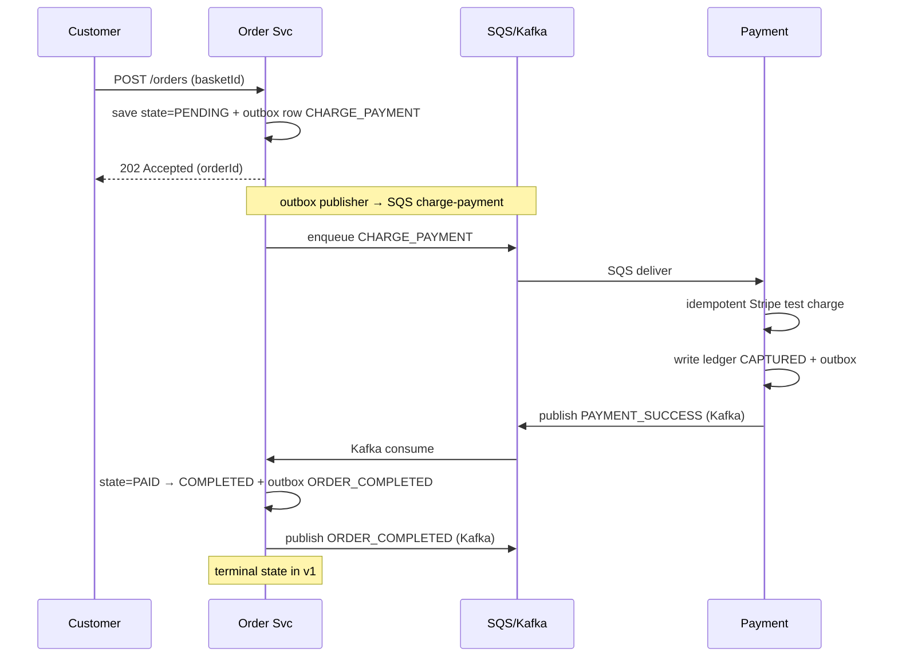
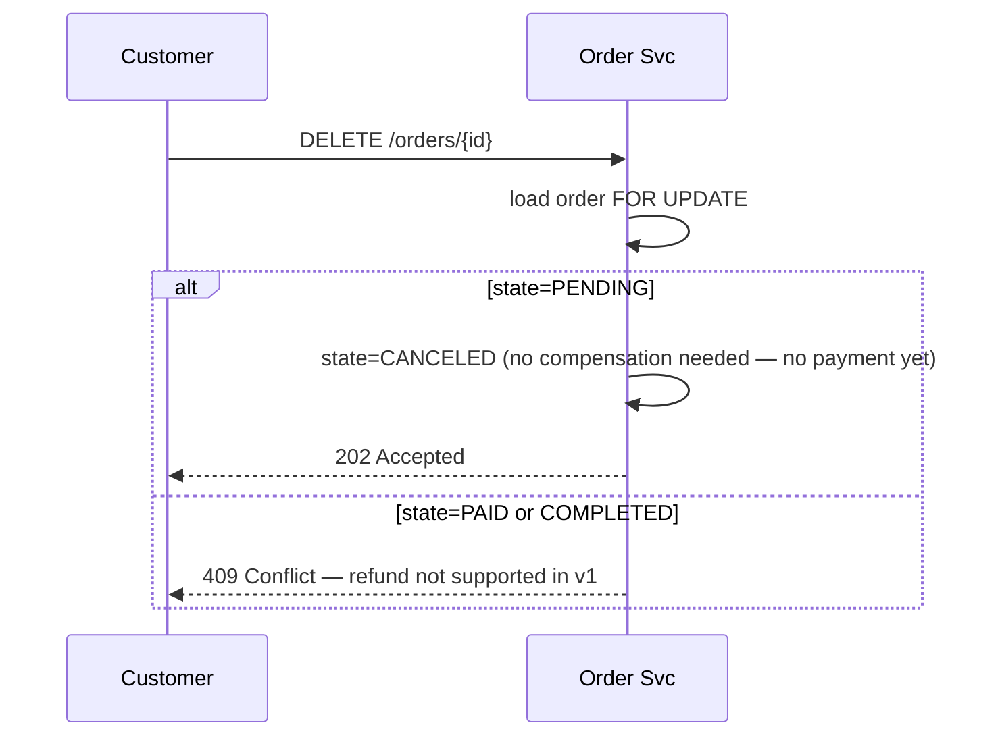
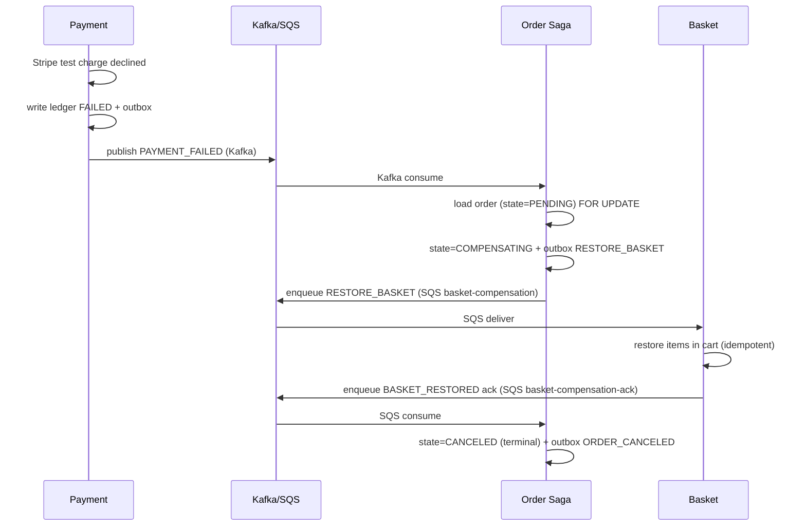
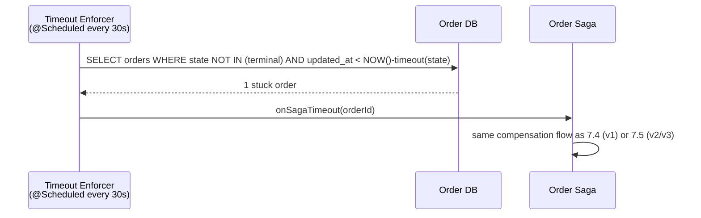

# Food Delivery System — Architecture Reference

> **Purpose**: This is the architecture and design reference for a production-grade food ordering microservices platform on AWS. It describes *what* you're building and *why* the choices were made — not *how* to build it step-by-step.
>
> The companion document **`build-plan.md`** contains the 99 build steps across 21 phases that turn this architecture into running code, organized into four shippable versions (v1 through v4). Read this document once for context, then re-consult specific sections from individual build steps as needed.

---

## How to Use This Document

This is a reference, not an action plan. Read it in order on first pass to understand the system. After that, jump to specific sections as build steps reference them. **Section 4** (Resilience Patterns), **Section 5** (Data Design), **Section 8** (Saga & Outbox), and **Section 10** (CI/CD Pipeline) are the most-cross-referenced sections from the build plan — keep them handy.

The architectural decisions documented here are **fixed for the platform**. If you want to change one (different DB, different messaging, etc.), update this document first, then propagate the change through `build-plan.md`. Don't make architectural changes inside individual build steps.

### Version annotations

The platform is built in four versions, each shippable. Throughout this document, you'll see version tags marking when each service or feature lands:

| Tag | Meaning |
|---|---|
| **[v1]** | Built as part of the reference implementation. Shipped at the end of v1. |
| **[v2]** | Added in v2 (restaurant operations — kitchen, delivery, expanded saga). |
| **[v3]** | Added in v3 (engagement features — review, promotion, notification). |
| **[v4]** | Hardened in v4 (payment-service graduates from minimal to full production-grade). |

**v1 is the reference implementation.** It contains every architectural pattern used across the whole platform — outbox, saga, gRPC, Resilience4j, the three Spring profiles, JWT auth, CodePipeline + ArgoCD GitOps, Argo Rollouts canaries, Prometheus + Grafana + X-Ray observability, SLO alerts, WAF, DR. v2/v3/v4 add more *instances* of these patterns; they don't introduce new patterns.

When a section describes a feature with a `[v4]` tag and a `[v1 minimal]` callout, that means the v1 version exists in slim form and v4 hardens it. The clearest example is payment-service: v1 builds a minimal Stripe-test-mode integration; v4 adds webhooks, refunds, the full Resilience4j stack, and a DDB-Streams-based outbox.

---

## Table of Contents

1. [High-Level Architecture Overview](#1-high-level-architecture-overview)
2. [Service Responsibilities & Interaction Design](#2-service-responsibilities--interaction-design)
3. [AWS Service Mapping](#3-aws-service-mapping)
4. [Resilience Patterns Per Service](#4-resilience-patterns-per-service)
5. [Data Design Decisions](#5-data-design-decisions)
6. [Version Overview](#6-version-overview)
7. [Order Flow in Detail](#7-order-flow-in-detail)
8. [Saga & Outbox Pattern in Order Service](#8-saga--outbox-pattern-in-order-service)
9. [Key Best Practices by Category](#9-key-best-practices-by-category)
10. [CI/CD Pipeline (AWS Native)](#10-cicd-pipeline-aws-native)

---

# PART A — REFERENCE DOCUMENTATION

## 1. High-Level Architecture Overview

The system is split into ten microservices organized by domain. All services run on EKS Fargate except Notification, which runs as Lambda for cost efficiency. Three communication mechanisms run between services: REST/HTTP through API Gateway, gRPC for internal synchronous calls where latency matters, and asynchronous events for everything that doesn't need an immediate response. The async layer is **hybrid**: Amazon MSK (managed Kafka) for the domain-event backbone where replay value matters, and SNS/SQS for simpler patterns (Lambda triggers, webhook intake, point-to-point queues).

```
                       ┌─────────────────────────────────────┐
                       │              CLIENTS                │
                       │  Customer App · Restaurant POS ·    │
                       │           Driver App                │
                       └─────────────────┬───────────────────┘
                                         │
                       ┌─────────────────▼───────────────────┐
                       │       API GATEWAY + ALB             │
                       │  JWT validation · Rate limiting ·   │
                       │            WAF · Routing            │
                       └─────────────────┬───────────────────┘
                                         │
   ┌─────────────────────────────────────┼─────────────────────────────────────┐
   │                                     │                                     │
   │     EDGE TIER (customer-facing)                                           │
   │  ┌─────────────┐ ┌─────────────┐ ┌─────────────┐                          │
   │  │   User      │ │  Product    │ │   Basket    │                          │
   │  │ Service[v1] │ │Service [v1] │ │Service [v1] │                          │
   │  └─────────────┘ └─────────────┘ └─────────────┘                          │
   │                                                                           │
   │     CORE TIER (transaction processing)                                    │
   │  ┌─────────────┐ ┌─────────────┐ ┌─────────────┐                          │
   │  │    Order    │ │   Payment   │ │  Promotion  │                          │
   │  │Service [v1] │ │ Svc [v1/v4] │ │Service [v3] │                          │
   │  └─────────────┘ └─────────────┘ └─────────────┘                          │
   │                                                                           │
   │     FULFILLMENT TIER                                                      │
   │  ┌─────────────┐ ┌─────────────┐ ┌─────────────┐                          │
   │  │   Kitchen   │ │  Delivery   │ │   Review    │                          │
   │  │Service [v2] │ │Service [v2] │ │Service [v3] │                          │
   │  └─────────────┘ └─────────────┘ └─────────────┘                          │
   │                                                                           │
   │     COMMUNICATION HUB                                                     │
   │  ┌───────────────────────────────┐                                        │
   │  │   Notification Lambda [v3]    │                                        │
   │  │   SES email · SNS Mobile Push │                                        │
   │  └───────────────────────────────┘                                        │
   └─────────────────────────────────────┬─────────────────────────────────────┘
                                         │
   ┌─────────────────────────────────────▼─────────────────────────────────────┐
   │                          ASYNC MESSAGING LAYER                            │
   │  ┌──────────────────────────────────┐  ┌──────────────────────────────┐   │
   │  │    Amazon MSK (Kafka)            │  │       SNS + SQS              │   │
   │  │    Domain event backbone         │  │   Lambda triggers,           │   │
   │  │    (replay-capable)              │  │   webhook intake,            │   │
   │  │                                  │  │   simple fan-out             │   │
   │  │  v1 topics:                      │  │                              │   │
   │  │   user-events                    │  │  v1 queues:                  │   │
   │  │   order-events                   │  │   charge-payment             │   │
   │  │   payment-events                 │  │   basket-compensation        │   │
   │  │                                  │  │                              │   │
   │  │  v2 adds:                        │  │  v2 adds:                    │   │
   │  │   kitchen-events                 │  │   kitchen-compensation       │   │
   │  │   delivery-events                │  │   delivery-compensation      │   │
   │  │   driver-status (key=driverId)   │  │                              │   │
   │  │                                  │  │                              │   │
   │  │  v3 adds:                        │  │  v4 adds:                    │   │
   │  │   promotion-events               │  │   stripe-webhooks (SNS→SQS)  │   │
   │  │                                  │  │   payment-refund             │   │
   │  └──────────────────────────────────┘  └──────────────────────────────┘   │
   │       Both fed by service outbox publishers (Postgres outbox or DDB       │
   │       Streams). Notification Lambda triggers from MSK topics.             │
   └─────────────────────────────────────┬─────────────────────────────────────┘
                                         │
   ┌─────────────────────────────────────┼─────────────────────────────────────┐
   │                                     │     DATA TIER (polyglot)            │
   │  ┌──────────────────────┐  ┌──────────────────────┐                       │
   │  │  RDS Aurora          │  │  DynamoDB            │                       │
   │  │  PostgreSQL          │  │  Kitchen, Payment,   │                       │
   │  │  User, Product,      │  │  Review,             │                       │
   │  │  Order, Promotion,   │  │  Idempotency keys    │                       │
   │  │  Delivery            │  │                      │                       │
   │  └──────────────────────┘  └──────────────────────┘                       │
   │  ┌──────────────────────┐  ┌──────────────────────┐                       │
   │  │  ElastiCache Redis   │  │  S3 + CloudFront     │                       │
   │  │  Basket, Product     │  │  Product images,     │                       │
   │  │  cache, Sessions,    │  │  Templates, Receipts │                       │
   │  │  Rate limits         │  │                      │                       │
   │  └──────────────────────┘  └──────────────────────┘                       │
   └───────────────────────────────────────────────────────────────────────────┘
```

### Communication Patterns Summary

| Pattern | When to Use | Examples |
|---|---|---|
| REST (sync, public) | Client → API Gateway | All public APIs |
| gRPC (sync, internal) | Service → Service when latency matters | Basket → Product [v1] (verify item), Order → Promotion [v3] (validate code) |
| **Kafka topic (async, replay-capable)** | **Domain events that other services react to and that may need to be replayed** | `USER_CREATED`, `ORDER_PAID`, `ORDER_COMPLETED` [v1]; `FOOD_READY`, `ORDER_DELIVERED` [v2]; `PROMO_ISSUED` [v3]; `PAYMENT_SUCCESS/FAILED` [v1] |
| **Kafka topic (keyed for ordering)** | **Strict per-key ordering at scale** | Driver status updates keyed by `driverId` [v2] (replaces SQS FIFO) |
| **SNS + SQS** | **Lambda triggers, webhook intake, simple fan-out where replay isn't needed** | Notification Lambda *can* also subscribe directly to MSK [v3]; SQS is used for compensation commands [v1] and Stripe webhook intake [v4] |

### When Kafka vs SNS/SQS

This plan uses Kafka (Amazon MSK) for **domain events**, defined as: facts about something that happened in the system that other services may want to react to, **and** where the ability to replay history (rebuild a downstream service's state, add a new consumer later, audit what happened) has real value.

It uses SNS/SQS for:
- **Saga compensation commands** [v1] — point-to-point messages where Order Service tells Basket to restore the cart on payment failure. Commands are time-bound; replay would be wrong.
- **Stripe webhook intake** [v4] — public HTTP endpoint posts to SNS → SQS → Payment service. Simple, no replay value.
- **Internal queue patterns** — anywhere we want at-least-once delivery to a single consumer with a DLQ but no fan-out.

Notification Lambda [v3] has its own topic subscriptions (Lambda has native MSK event source support), so it pulls receipt requests, welcome emails, and "enjoy" pushes directly from Kafka.

---

## 2. Service Responsibilities & Interaction Design

### 2.1 User Service `[v1 — pilot]`

**Role**: Manages three user personas (Customer, Restaurant, Driver) and their roles, plus authentication and JWT issuance.

**Logic**: On registration it writes the user record and a `USER_CREATED` event to the outbox in the same database transaction. JWT tokens are signed with RS256 and carry custom claims (`role`, `restaurantId`, `driverId`) so downstream services authorize without callbacks. Other services validate the JWT signature locally using the public key cached from Parameter Store. Login issues short-lived access tokens (15 min) plus refresh tokens (30 days) stored in Redis.

This service is the **pilot for v1** — built first, end-to-end through staging, with its CI/CD pipeline and observability dashboard. The deploy template captured from this service (`docs/service-deploy-template.md`) becomes the template for every subsequent service across v1, v2, v3, and v4.

**AWS**: EKS Fargate in private subnet. RDS PostgreSQL with read replica for non-auth queries.

**Internal layering**: although it's one service, the code is organized so auth concerns and user-data concerns are separated at the controller and service layers (`AuthController` + `UserController`, `AuthenticationService` + `RegistrationService` + `UserProfileService`). If a future scale point ever justifies splitting auth into its own service, the seams are already visible.

**Key endpoints**:
- `POST /v1/auth/register` (public)
- `POST /v1/auth/login` (public)
- `POST /v1/auth/refresh` (public)
- `GET /v1/users/me` (authenticated)
- `PATCH /v1/users/me` (authenticated)

### 2.2 Product Service `[v1]`

**Role**: Product catalog with stock management. Products are items with a price, category, and stock level — referenced by Basket and Order services.

**Logic**: Read-heavy service with a high read/write ratio. Cache-aside with Redis: read tries cache first, falls through to Aurora PostgreSQL on miss, populates cache with 30-minute TTL. Writes (price changes, stock updates) use JPA with `@Version` optimistic locking then explicitly purge the affected Redis key. Exposes a gRPC endpoint for Basket and Order services to verify item availability and current price in real time. Subscribes to `RESTAURANT_PAUSED` events from Kitchen Service [v2] and hides associated products from results.

**AWS**: EKS Fargate. Aurora PostgreSQL (shared cluster from Step 0.4) for product catalog. ElastiCache Redis for caching. S3 + CloudFront for product images.

**Key endpoints**:
- `GET /v1/products` (public, paginated, category-filtered)
- `GET /v1/products/{id}` (public, cached)
- `POST /v1/products` (ADMIN authenticated)
- `gRPC ProductService.VerifyProduct(productId)` (internal)

### 2.3 Basket Service `[v1]`

**Role**: Real-time intent storage for items a user is considering.

**Logic**: Carts are stored as Redis hashes keyed by `userId`. Each "Add to basket" request includes an idempotency key (UUID generated client-side) — duplicate requests with the same key return the prior result. Add-item uses **upsert-by-productId**: posting the same product twice (with or without an idempotency key) results in one entry with combined quantity, not two entries. Before adding an item it makes a gRPC call to Product Service to confirm the item is still active and the price is current. Carts auto-expire after 24 hours via Redis TTL. On checkout the cart is locked and converted into an order request.

**AWS**: EKS Fargate. ElastiCache Redis (Cluster Mode) as primary store.

**Key endpoints**:
- `GET /v1/basket` (authenticated)
- `POST /v1/basket/items` (authenticated, idempotency-key required)
- `DELETE /v1/basket/items/{itemId}` (authenticated)
- `POST /v1/basket/checkout` (authenticated)

### 2.4 Order Service `[v1 mini-saga | v2 expanded saga]`

**Role**: The Saga Leader and order state manager. The most important service in the system.

**v1 mini-saga (6 states)**: owns a small but real state machine `PENDING → PAID → COMPLETED` with one compensation path `PENDING → COMPENSATING → CANCELED` triggered by payment failure or saga timeout. One compensation action exists in v1: `RESTORE_BASKET` on payment failure. The pattern is real even though the surface is small — outbox, idempotent consumers, optimistic locking, saga timeout enforcer all built and demonstrated in v1.

**v2 expanded saga (10 states)**: v2 inserts kitchen and delivery states between `PAID` and `COMPLETED` (`PAID → KITCHEN_ACCEPTED → FOOD_READY → OUT_FOR_DELIVERY → DELIVERED`) and adds multiple compensation actions (cancel kitchen ticket, free driver). No new architectural patterns — the v1 saga pattern just gets more state transitions and more compensation handlers.

**v3 promotion integration**: v3 adds `RESTORE_PROMO_CODE` as a new compensation action when promotion-service ships.

**Logic across all versions**: manages the Transactional Outbox to ensure commands reach downstream services reliably. Every state transition writes the new state plus the next saga command(s) to the outbox in one transaction. A scheduled `SagaTimeoutEnforcer` catches stuck orders (no progress within the per-state timeout) and triggers compensation. It is the only service authorized to issue compensating transactions.

**AWS**: EKS Fargate (4+ replicas, highest criticality). RDS PostgreSQL for transactional integrity (orders + outbox in same DB).

**Key endpoints**:
- `POST /v1/orders` (authenticated, from basket checkout)
- `GET /v1/orders/{id}` (authenticated)
- `GET /v1/orders` (authenticated, paginated, with status/date filters)
- `DELETE /v1/orders/{id}` (authenticated, conditional on state)

### 2.5 Kitchen Service `[v2]`

**Role**: Restaurant operations and capacity management.

**Logic**: Doesn't track ingredients but tracks kitchen capacity. When a restaurant has too many "Preparing" orders (configurable per restaurant), it publishes a `RESTAURANT_PAUSED` event that Product Service consumes to hide that restaurant from search. Manages ticket lifecycle: `ACCEPTED → PREPARING → READY_FOR_PICKUP`. When the chef marks a ticket "Ready," it writes a `FOOD_READY` event to its outbox so Delivery Service knows to pick up.

Consumes `ORDER_COMPLETED` from v1 — actually, v2 changes this slightly: when kitchen-service ships, order-service's saga expands so the event consumed by kitchen becomes `ORDER_PAID` (the new v2 state), not the v1 terminal `ORDER_COMPLETED`. The semantics are equivalent: "this order has been paid and needs preparation."

**AWS**: EKS Fargate. DynamoDB to track active tickets per restaurant.

**Key endpoints**:
- `GET /v1/restaurants/{id}/tickets` (restaurant-owner authenticated)
- `PATCH /v1/tickets/{id}/status` (restaurant-owner authenticated)

### 2.6 Payment Service `[v1 minimal | v4 hardened]`

**Role**: Secure financial interface — proxy to external payment gateways.

**v1 minimal**: SQS-driven service that consumes `CHARGE_PAYMENT` commands from the `charge-payment` queue, calls Stripe **test mode** with idempotency, records the result in an append-only DynamoDB ledger, and emits `PAYMENT_SUCCESS` or `PAYMENT_FAILED` events to Kafka. Demonstrates the patterns (DDB ledger, idempotency on external API calls, outbox emitting to Kafka) without operational weight. Deliberately defers: Stripe webhook signature verification, refund flows, full Resilience4j stack, DDB Streams-based outbox publisher. **v1 has no webhook endpoint** — it trusts the synchronous Stripe response, which is acceptable because all v1 payments are test mode.

**v4 hardened**: adds the full ledger entry types (`AUTHORIZED`, `REFUNDED`, `DISPUTED` join the v1 set), Stripe webhook handling with signature verification, full Resilience4j stack (circuit breaker + retry + bulkhead + rate limiter + time limiter), refund endpoint, DDB Streams-driven outbox publisher Lambda. v4 runs alongside v1 minimal during migration (feature flag controls which queue order-service writes to), then v1 minimal is retired.

**Logic (both versions)**: strictly idempotent — every charge request keys on the order ID. Before calling Stripe it checks DynamoDB for that key; if found, returns the prior result without re-charging. The DynamoDB ledger is append-only and serves as the source of truth for financial reconciliation.

**AWS**: EKS Fargate in dedicated private subnet (stricter SGs). DynamoDB for immutable transaction ledger.

**Key endpoints**:
- *v1*: SQS listener only, no public REST surface. Admin/health endpoints via Actuator.
- *v4*: adds `POST /v1/payments/refund` (internal, called by Order Service) and `POST /v1/webhooks/stripe` (public, Stripe webhook signature verified).

### 2.7 Promotion & Loyalty Service `[v3]`

**Role**: Rules engine for discounts and growth.

**Logic**: Three responsibilities:
1. **First-Time Discount**: Listens for `USER_CREATED` events (already emitted by user-service since v1) and automatically issues a "Welcome" promo code.
2. **Tiered Rewards**: Checks order totals (e.g., > $50 → "Free Delivery").
3. **Validation**: Receives gRPC requests from Order Service at checkout to validate codes and compute discount amounts. When promotion-service ships in v3, order-service is updated to call `ValidateCode` during order creation and `RedeemCode` during the saga's `PAID` transition, plus a new compensation action `RestoreCode`.

Uses a unique constraint `(userId, codeType)` to prevent duplicate issuance under retries. Tracks code state: `ISSUED → USED → EXPIRED`.

**AWS**: EKS Fargate. RDS PostgreSQL for promo state with strong consistency.

**Key endpoints**:
- `gRPC PromotionService.ValidateCode(userId, code, orderAmount)` (internal)
- `gRPC PromotionService.RedeemCode(userId, code, orderId)` (internal)
- `gRPC PromotionService.RestoreCode(userId, code)` (internal, for compensation)

### 2.8 Delivery (Dispatch) Service `[v2]`

**Role**: Simplified job board for couriers.

**Logic**: Once an order is paid and kitchen marks it ready (consumes `FOOD_READY` event), it creates a `DeliveryTask` and broadcasts via SNS Mobile Push to active drivers. The first driver to call `POST /tasks/{id}/claim` wins via PostgreSQL row-level locking (`SELECT … FOR UPDATE NOWAIT`) — losers receive `409 Conflict`. Status updates flow through the Kafka topic `driver-status` keyed by `driverId` to guarantee ordering per driver. Transitions: `BROADCAST → ASSIGNED → PICKED_UP → DELIVERED`. No GPS tracking in v1.

**AWS**: EKS Fargate. RDS PostgreSQL for task state. Kafka topic `driver-status` for driver status updates.

**Key endpoints**:
- `POST /v1/delivery/tasks/{id}/claim` (driver authenticated)
- `PATCH /v1/delivery/tasks/{id}/status` (driver authenticated)
- `GET /v1/delivery/tasks/available` (driver authenticated)

### 2.9 Review & Feedback Service `[v3]`

**Role**: Social proof and quality control.

**Logic**: Multi-entity feedback — users review the Restaurant, the Driver, and specific Meals separately. Flexible NoSQL schema accommodates different rating shapes. DynamoDB partition key is `REVIEW#{type}#{entityId}` (where `type` is `RESTAURANT`, `DRIVER`, or `MEAL`). Composite key `(PK, SK=orderId#userId)` enforces "one review per user-order-entity tuple" — duplicate submissions return 409 with `ApiError { code: "REVIEW_ALREADY_SUBMITTED" }`. A DynamoDB Stream-triggered Lambda updates a separate aggregate counters table for read efficiency (avg rating, count). Subscribes to `ORDER_DELIVERED` events to open the review window for that order; auto-closes after 7 days. Read endpoints paginate via `Page<ReviewResponseDto>` with `@PageableDefault(size=20)`.

**AWS**: EKS Fargate. DynamoDB for ratings + DynamoDB Streams + Lambda for aggregation.

**Key endpoints**:
- `POST /v1/reviews` (customer authenticated)
- `GET /v1/restaurants/{id}/reviews` (public, paginated)
- `GET /v1/drivers/{id}/reviews` (driver/admin authenticated)
- `GET /v1/reviews/orders/{orderId}` (authenticated, paginated)

### 2.10 Notification Service `[v3]`

**Role**: Asynchronous communication hub.

**Logic**: Triggered by MSK event source mappings (native Lambda → MSK integration) for the bulk of events, plus an SQS event source for webhook-driven cases (Stripe `charge.refunded` in v4). The Lambda fetches a Mustache template from S3 (versioned by template ID), renders it with the event payload, and sends via SES (email) or SNS Mobile Push (FCM/APNS). Failed sends go to a dead-letter queue with a CloudWatch alarm. Idempotent: deduplicates on `(eventId, channel, recipient)` using DynamoDB conditional writes with TTL.

**AWS**: AWS Lambda (Java 25 Corretto runtime, 512 MB). Triggered by MSK + SQS. SES for email. SNS Mobile Push. S3 for templates. DynamoDB for idempotency.

**Triggers consumed**:
- `USER_CREATED` [v1 event, v3 consumer] → welcome email
- `ORDER_COMPLETED` / `ORDER_PAID` [v1] → receipt email
- `FOOD_READY` [v2] → "Your food is on the way" push
- `ORDER_DELIVERED` [v2] → "Enjoy" push + review request
- `PAYMENT_FAILED` [v1] → payment failure email + retry link
- `charge.refunded` [v4, via SQS from Stripe webhook] → refund confirmation email

---

## 3. AWS Service Mapping

This section provides a service-by-service breakdown of every AWS resource you will provision. Each subsection is tagged with the version that introduces the service; resources within may be tagged where they appear later than the service itself (most aren't — when a service ships, all its resources ship with it).

### 3.1 User Service `[v1 — pilot]`
| Concern | AWS Service | Notes |
|---|---|---|
| Compute | EKS Fargate (private subnet) | 2+ replicas, HPA on CPU 70% |
| Primary database | RDS Aurora PostgreSQL | Multi-AZ, 1 read replica |
| Cache (refresh tokens, JWT public key) | ElastiCache Redis | Shared cluster |
| Secret management | Secrets Manager | DB credentials, JWT private key |
| Public key distribution | SSM Parameter Store | JWT public key, 1-day TTL |
| Outbox publisher | EKS sidecar (Spring scheduler) | Polls every 500ms, publishes to Kafka |
| **Event publishing** | **Amazon MSK topic `user-events`** | **Replay-capable, partitioned by `userId`** |
| Logs | CloudWatch Logs via Fluent Bit | 30-day retention |
| Metrics | Amazon Managed Prometheus | Scrapes Spring Actuator |
| Tracing | AWS X-Ray | OTel SDK auto-instrumentation |
| IAM | IRSA role (read SSM, write to MSK, read Secrets) | Least privilege |

### 3.2 Product Service `[v1]`
| Concern | AWS Service | Notes |
|---|---|---|
| Compute | EKS Fargate | 3+ replicas, autoscale on RPS |
| Primary store | Aurora PostgreSQL (shared cluster) | `products` table with `@Version` optimistic locking |
| Image storage | S3 bucket `product-images-{env}` | Versioning enabled |
| Image CDN | CloudFront distribution | 24-hour cache |
| Cache layer | ElastiCache Redis | Cluster Mode, 30-min TTL |
| Internal API | gRPC over HTTP/2 on ALB | Internal only |
| **Event consumption** | **MSK consumer for `kitchen-events` topic** `[v2-active]` | **For `RESTAURANT_PAUSED`/`RESTAURANT_RESUMED`. Topic doesn't exist until v2; product-service simply has nothing to consume from it in v1.** |
| IAM | IRSA (Aurora access via Secrets Manager, S3 read, Redis access, MSK consume) | |

### 3.3 Basket Service `[v1]`
| Concern | AWS Service | Notes |
|---|---|---|
| Compute | EKS Fargate | 3+ replicas |
| Primary store | ElastiCache Redis (Cluster Mode) | TTL 24h, hash per cart |
| Idempotency keys | ElastiCache Redis | Same cluster, prefix `idem:` |
| Internal client | gRPC client to Product Service | Resilience4j wrapped |
| Compensation consumption | SQS `basket-compensation` queue | For `RESTORE_BASKET` from Order |
| IAM | IRSA (Redis access, ALB, SQS consume) | |

### 3.4 Order Service `[v1 mini-saga | v2 expanded]`
| Concern | AWS Service | Notes |
|---|---|---|
| Compute | EKS Fargate | 4+ replicas (highest criticality) |
| Primary database | RDS Aurora PostgreSQL | Multi-AZ, 2 read replicas |
| Outbox table | Same Aurora DB | Indexed on `(processed_at, created_at)` |
| Outbox publisher | EKS sidecar with `SELECT FOR UPDATE SKIP LOCKED` | Multiple instances safe; publishes to Kafka and SQS |
| **Event publishing** | **MSK topic `order-events`** | **Partitioned by `orderId` for per-order ordering** |
| **Event consumption (v1)** | **MSK consumer group for `payment-events`** | **For `PAYMENT_SUCCESS` and `PAYMENT_FAILED`** |
| **Event consumption (v2+)** | **MSK consumer groups for `kitchen-events`, `delivery-events`** | **Added when v2 services ship** |
| Compensation commands (v1) | SQS queue `basket-compensation` | Point-to-point; one compensation in v1 |
| Compensation commands (v2+) | SQS queues `kitchen-compensation`, `delivery-compensation` | Added in v2 |
| Compensation commands (v3+) | SQS queue `promotion-compensation` | Added in v3 |
| Internal calls (v3+) | gRPC to Promotion Service | Synchronous validation |
| Saga timeout | Spring scheduled task + DB query | Every 30s |
| IAM | IRSA (DB, MSK produce/consume, SQS publish/consume, gRPC) | |

### 3.5 Kitchen Service `[v2]`
| Concern | AWS Service | Notes |
|---|---|---|
| Compute | EKS Fargate | 2+ replicas |
| Primary store | DynamoDB `tickets` table | PK = restaurantId, SK = ticketId |
| Capacity counter | DynamoDB atomic counter | `ADD active_tickets 1` |
| Outbox | DynamoDB `outbox-kitchen` table with TTL | Stream-triggered Lambda publisher |
| **Event consumption** | **MSK consumer for `order-events`** | **For `ORDER_PAID` (the v2 event emitted when order-service's expanded saga reaches the `PAID` state)** |
| Compensation consumption | SQS `kitchen-compensation` queue | For `CANCEL_KITCHEN_TICKET` from Order |
| **Event publishing** | **MSK topic `kitchen-events`** | **`FOOD_READY`, `RESTAURANT_PAUSED`, `RESTAURANT_RESUMED`** |
| IAM | IRSA (DDB read/write, MSK produce/consume, SQS consume) | |

### 3.6 Payment Service `[v1 minimal | v4 hardened]`
| Concern | AWS Service | Notes |
|---|---|---|
| Compute | EKS Fargate (dedicated subnet, stricter SG) | 3+ replicas |
| Primary store | DynamoDB `payment-ledger` table | Append-only, PIT recovery on |
| Idempotency index | DynamoDB GSI on `idempotency_key` | Lookup before charge |
| Stripe API key | Secrets Manager | v1 uses test mode key; v4 adds auto-rotation via Stripe API |
| **Command consumption (v1)** | **SQS `charge-payment` queue** | **From order-service** |
| **Webhook intake** `[v4-only]` | **API Gateway → SNS → SQS → Service** | **Public endpoint, signature verified, SQS for buffering** |
| **Event publishing** | **MSK topic `payment-events`** | **`PAYMENT_SUCCESS`, `PAYMENT_FAILED` [v1]; `PAYMENT_REFUNDED` [v4]** |
| Outbox publisher (v1) | Polling Spring scheduled task in same pod | Publishes outbox rows to MSK |
| Outbox publisher (v4) | DDB Streams + Lambda publisher | Replaces v1 polling; lower latency |
| Refund command consumption `[v4-only]` | SQS `payment-refund` queue | Compensation command from Order |
| Resilience (v1) | Resilience4j retry (3 attempts) + time limiter (5s) | Basic only |
| Resilience (v4) | Full Resilience4j stack: circuit breaker + retry + bulkhead + rate limiter + time limiter | Per-pod, per-operation |
| Outbound NAT | NAT Gateway (Stripe API) | One per AZ |
| IAM | IRSA (DDB, MSK produce, SQS consume, Secrets, KMS) | |

### 3.7 Promotion & Loyalty Service `[v3]`
| Concern | AWS Service | Notes |
|---|---|---|
| Compute | EKS Fargate | 2+ replicas |
| Primary database | RDS Aurora PostgreSQL | Shared cluster with User (different DB) |
| Internal API | gRPC over HTTP/2 on ALB | Internal only |
| **Event consumption** | **MSK consumer for `user-events`** | **For `USER_CREATED` (already emitted by user-service since v1)** |
| Compensation consumption | SQS `promotion-compensation` queue | For `RESTORE_PROMO_CODE` (point-to-point command) |
| **Event publishing** | **MSK topic `promotion-events`** | **`PROMO_ISSUED`, `PROMO_REDEEMED`** |
| Outbox | Same Aurora DB | For Kafka publisher sidecar |
| IAM | IRSA (DB, MSK produce/consume, SQS consume) | |

### 3.8 Delivery Service `[v2]`
| Concern | AWS Service | Notes |
|---|---|---|
| Compute | EKS Fargate | 2+ replicas |
| Primary database | RDS Aurora PostgreSQL | Shared cluster, separate DB |
| Driver broadcast | SNS Mobile Push | FCM/APNS for driver app |
| **Driver status updates** | **MSK topic `driver-status` (keyed by `driverId`)** | **Per-driver ordering at scale** |
| **Event consumption** | **MSK consumer for `kitchen-events`** | **For `FOOD_READY`** |
| Compensation consumption | SQS `delivery-compensation` queue | For `RELEASE_DRIVER` from Order |
| **Event publishing** | **MSK topic `delivery-events`** | **`DELIVERY_ASSIGNED`, `ORDER_DELIVERED`, `DELIVERY_FAILED`** |
| Outbox | Same Aurora DB | For Kafka publisher sidecar |
| IAM | IRSA (DB, MSK produce/consume, SQS consume, SNS Mobile Push) | |

### 3.9 Review & Feedback Service `[v3]`
| Concern | AWS Service | Notes |
|---|---|---|
| Compute | EKS Fargate | 2+ replicas |
| Primary store | DynamoDB `reviews` table | PK = `REVIEW#{type}#{entityId}`, SK = `orderId#userId` |
| Aggregations | DynamoDB `review-aggregates` table | Updated by Stream Lambda |
| **Event consumption** | **MSK consumer for `delivery-events`** | **For `ORDER_DELIVERED`** |
| Aggregation Lambda | AWS Lambda + DDB Streams | Computes avg, count |
| IAM | IRSA + Lambda role | |

### 3.10 Notification Service `[v3]`
| Concern | AWS Service | Notes |
|---|---|---|
| Compute | AWS Lambda | **Java 25 runtime (Corretto), 512 MB** |
| **Primary triggers** | **Lambda MSK event source mappings** | **Native Lambda → MSK integration; one event source per topic** |
| Webhook-style triggers `[v4]` | SQS event source | For Stripe webhook → refund-confirmation email |
| Templates | S3 bucket `notification-templates-{env}` | Versioned, KMS-encrypted |
| Email | Amazon SES | Verified domain, dedicated IP pool |
| Push | SNS Mobile Push (FCM/APNS) | Platform applications per app |
| Idempotency | DynamoDB `notification-idempotency` | TTL 7 days |
| Dead-letter | Lambda DLQ (SQS) + CloudWatch alarm on depth | |
| IAM | Lambda execution role (MSK consume, SES send, SNS publish, S3 read, DDB) | |

---

## 4. Resilience Patterns Per Service

A clean per-service list. For implementation guidance, see **`build-plan.md` Phase 1 Step 1.3** (shared Resilience4j configurations in the `common-libs/common-resilience` module) and **`build-plan.md` Phase 6 Step 6.4** (saga compensation logic in the Order Service, v1 mini-saga).

- **User Service** `[v1]`: Rate Limiter, Timeout, Retry, Bulkhead
- **Product Service** `[v1]`: Cache-Aside, Timeout, Bulkhead, Rate Limiter
- **Basket Service** `[v1]`: Idempotency Key, Upsert-by-productId, Timeout, Retry, Circuit Breaker (gRPC → Product)
- **Order Service** `[v1]`: Saga (mini, 6 states), Outbox, Idempotent Consumers, Retry, Timeout, Bulkhead, Compensating Transactions (1 path in v1), Saga Timeout Enforcer. **`[v2]` extends**: more states, more compensation paths.
- **Payment Service** `[v1 minimal]`: Idempotency Key, basic Retry with Exponential Backoff, Time Limiter. **`[v4 hardened]` adds**: Circuit Breaker, Bulkhead, Rate Limiter.
- **Kitchen Service** `[v2]`: Outbox, Idempotency Key, Retry, Timeout
- **Promotion & Loyalty Service** `[v3]`: Circuit Breaker, Timeout, Retry, Idempotency Key
- **Delivery Service** `[v2]`: Outbox, Optimistic Locking (claim race), Retry, Timeout, Per-Driver Ordering via Kafka key
- **Review & Feedback Service** `[v3]`: Rate Limiter, Timeout, Retry
- **Notification Service (Lambda)** `[v3]`: Retry with DLQ, Idempotency Key, Timeout

---

## 5. Data Design Decisions

The choice of database per service follows access patterns, not preference.

### 5.1 RDS PostgreSQL (Aurora) — User, Order, Promotion, Delivery

These services need ACID transactions because they all rely on the outbox pattern, which requires writing the business state and the outbox event in a single atomic transaction. They also benefit from joins, unique constraints, and read replicas.

- **User** `[v1]` needs unique constraints on `email` and `phone` to prevent duplicates, plus complex queries for admin views.
- **Order** `[v1]` needs joins between `orders`, `order_items`, and `saga_compensation_acks` tables. Outbox in same DB.
- **Promotion** `[v3]` enforces "one promo code per user per type" via unique constraints, with ACID-safe code redemption.
- **Delivery** `[v2]` uses row-level locking (`SELECT … FOR UPDATE NOWAIT`) for the claim race. PostgreSQL is the only option that gives this primitive cleanly.

PostgreSQL gives us all of this with read replicas for reporting and HA via Multi-AZ. Aurora Serverless v2 is the recommended starting point for cost.

### 5.2 DynamoDB — Kitchen, Payment, Review

These services have access patterns dominated by single-key lookups, predictable high throughput, or polymorphic data shapes. Product Service uses Aurora PostgreSQL (see section 5.1) — its access patterns are relational and benefit from optimistic locking and full-text queries.

- **Kitchen** `[v2]` is keyed by `restaurantId` for active tickets — single-key access pattern. Atomic counter for capacity.
- **Payment** `[v1 minimal / v4 full]` uses an immutable ledger keyed by `paymentIntentId`, with a GSI on `idempotencyKey` for the duplicate-charge check. Append-only. v1 has 3 entry types (`INITIATED`, `CAPTURED`, `FAILED`); v4 adds 3 more (`AUTHORIZED`, `REFUNDED`, `DISPUTED`).
- **Review** `[v3]` needs flexible schema (different fields for restaurant vs. driver vs. meal reviews) and high write throughput. DynamoDB on-demand handles unpredictable load (lunch and dinner rushes).

DynamoDB tables use on-demand billing for unpredictable workloads, with point-in-time recovery enabled for Payment.

### 5.3 ElastiCache Redis — Basket, Product Cache, Sessions, Rate Limit

Redis plays three roles:
- **Primary store** for Basket `[v1]` because carts are transient state — losing a cart on rare cache eviction is acceptable, and Cluster Mode gives durability anyway.
- **Cache layer** in front of Product Service `[v1]` with cache-aside pattern (TTL 30 min).
- **Rate-limiting and session store** shared by all services for cross-instance state. Sliding window counters via Lua scripts.

### 5.4 S3 + CloudFront — Static Assets

Stores product images `[v1]` (uploaded by restaurants), order receipts `[v3 — generated by Notification Lambda]` (PDF generated post-payment), and notification templates `[v3]` (Mustache files versioned by template ID). CloudFront sits in front for global edge caching of images.

### 5.5 Outbox Tables Schema

Every service that emits events shares this PostgreSQL schema:

```sql
CREATE TABLE outbox (
    id              UUID         PRIMARY KEY DEFAULT gen_random_uuid(),
    aggregate_type  VARCHAR(50)  NOT NULL,
    aggregate_id    VARCHAR(100) NOT NULL,
    event_type      VARCHAR(100) NOT NULL,
    destination_type VARCHAR(20) NOT NULL,  -- 'KAFKA' or 'SQS'
    destination     VARCHAR(200) NOT NULL,  -- topic name or queue ARN
    partition_key   VARCHAR(100) NOT NULL,
    payload         JSONB        NOT NULL,
    created_at      TIMESTAMPTZ  NOT NULL DEFAULT NOW(),
    processed_at    TIMESTAMPTZ  NULL,
    trace_id        VARCHAR(64)  NULL
);
CREATE INDEX idx_outbox_unprocessed
    ON outbox (created_at) WHERE processed_at IS NULL;
```

The `partition_key` column carries the value the publisher uses as the **Kafka partition key** when publishing — typically `aggregate_id` (e.g., `orderId` for `order-events`, `driverId` for `driver-status`). This guarantees per-aggregate ordering without requiring SQS FIFO.

The publisher sidecar polls unprocessed rows, dispatches to the right AWS client (`KafkaProducer` or `SqsClient`) based on `destination_type`, and marks the row processed. Domain events (`USER_CREATED`, `ORDER_PAID`, `PAYMENT_FAILED`) go to Kafka topics for replay capability. Compensation commands (`RESTORE_BASKET`, `CANCEL_KITCHEN_TICKET` [v2], `RESTORE_PROMO_CODE` [v3]) go to SQS for point-to-point delivery.

Kitchen Service `[v2]` and Payment Service `[v4]` use DynamoDB outbox tables instead, processed by Stream-triggered Lambda publishers that publish to Kafka. Payment Service in `[v1]` uses an in-pod polling publisher (same pattern as PostgreSQL services) — the DDB-Streams variant arrives in v4 along with the rest of payment-service's hardening.

---

## 6. Version Overview

The platform is built in four shippable versions. The detailed phase-by-phase breakdown lives in **`build-plan.md`** — this section gives the high-level shape so you can orient before opening the plan.

### v1 — Reference Implementation (5 services, ~6–8 weeks)

The bulk of the platform's architectural surface is built in v1: foundation IaC (VPC, EKS, RDS, DynamoDB, MSK, SNS/SQS, ECR, CodeArtifact, ArgoCD), shared libraries and BOM, observability stack, CI/CD pipelines, and five services demonstrating every pattern.

- **user-service** — the pilot. Built first, end-to-end through staging, with CI/CD pipeline and observability dashboard. The deploy template captured from this service becomes the template for every subsequent service across all four versions.
- **product-service** — restaurant menus and items, cache-aside with Redis, gRPC server for internal verification.
- **basket-service** — Redis-backed cart with upsert-by-productId and gRPC client to product-service.
- **payment-service (minimal)** — SQS-driven, Stripe test mode, DDB ledger, idempotency, outbox to Kafka. Deliberately defers webhooks, refunds, full Resilience4j, DDB-Streams outbox.
- **order-service (mini-saga)** — 6-state saga (PENDING → PAID → COMPLETED, plus PENDING → COMPENSATING → CANCELED), 1 compensation action (restore basket on payment failure). Real saga pattern; small surface.

By end of v1 you have a working food-delivery platform on real AWS. Customers can register, browse menus, add to cart, and place orders. The mini-saga coordinates order → payment with proper compensation on failure. v1 ends at production launch with SLOs green and DR drill complete.

### v2 — Restaurant Operations (~3–4 weeks)

Adds the restaurant and delivery side:

- **kitchen-service** — restaurants accept tickets, mark through preparation states, capacity-based auto-pause.
- **delivery-service** — drivers claim tasks (first-wins via `FOR UPDATE NOWAIT`), status updates per-driver-ordered via Kafka key.
- **Expanded order-service saga** — from 6 states to 10. Insert `KITCHEN_ACCEPTED`, `FOOD_READY`, `OUT_FOR_DELIVERY`, `DELIVERED` between `PAID` and the terminal state. Add `CANCEL_KITCHEN_TICKET` and `RELEASE_DRIVER` compensation actions.

No new architectural patterns. The v1 saga, outbox, gRPC, and resilience patterns all just get more instances.

### v3 — Engagement Features (~3–4 weeks)

Customer engagement:

- **review-service** — multi-entity reviews after delivery, DDB streams aggregation Lambda.
- **promotion-service** — first-time discounts (consumes v1's `USER_CREATED`), tiered rewards, gRPC validation called by order-service during the saga.
- **notification-service** — Lambda triggered by MSK event sources, SES email + SNS mobile push, S3 templates with versioning.

v3 introduces the saga's third compensation action: `RESTORE_PROMO_CODE` when an order is canceled after a promo was redeemed.

### v4 — Payment Hardening (~2–3 weeks)

The v1 minimal payment-service graduates to production-grade:

- New ledger entry types (`AUTHORIZED`, `REFUNDED`, `DISPUTED`)
- Stripe webhook handling with signature verification
- Full Resilience4j stack (circuit breaker + retry + bulkhead + rate limiter + time limiter)
- Refund endpoint
- DDB Streams-driven outbox publisher Lambda (replaces v1's polling publisher)

The migration runs the new hardened service alongside the v1 minimal one, gradually routing traffic via a feature flag, then retires v1. Order-service gains a real refund-based cancel path (v1 only allowed cancellation before payment).

### Total

Across all four versions: **99 build steps across 21 phases**, ~15–18 weeks for one engineer (less with parallelism). Each version is independently shippable.

For step-level detail, see `build-plan.md`.

---

## 7. Order Flow in Detail

This section shows the v1 flows first (because v1 is what you're building first) and notes how each flow expands in v2/v3/v4.

### 7.1 v1 Happy Path — Customer Orders Food

In v1, "placing an order" means: order created in PENDING, payment-service charges Stripe test mode, order transitions to PAID then immediately to COMPLETED. There's no kitchen, no delivery — paid = done.



**Step-by-step**:
1. Customer hits `POST /orders` with the basket token.
2. Order Service saves the order in `PENDING` state and writes an outbox row (a `CHARGE_PAYMENT` SQS command) in the same DB transaction.
3. Order returns `202 Accepted` immediately — final confirmation comes async.
4. The outbox publisher picks up the row and publishes the SQS message to the `charge-payment` queue.
5. Payment Service consumes the SQS message, checks DynamoDB for the idempotency key; if absent, calls Stripe test mode; on success stores the result in the immutable ledger.
6. Payment writes a `PAYMENT_SUCCESS` outbox row, published to Kafka topic `payment-events`.
7. Order Service consumes `PAYMENT_SUCCESS`, transitions PENDING → PAID → COMPLETED in one logical step, writes outbox row `ORDER_COMPLETED` to Kafka.
8. Order is terminal in v1.

### 7.2 v2 Expanded Happy Path — Now Including Kitchen and Delivery

When v2 ships, the same flow extends. `PAID` no longer auto-transitions to `COMPLETED`; instead, kitchen-service and delivery-service handle the in-between states.

```
v1 path:   PENDING → PAID → COMPLETED
v2 path:   PENDING → PAID → KITCHEN_ACCEPTED → FOOD_READY → OUT_FOR_DELIVERY → DELIVERED
```

Kitchen-service consumes `ORDER_PAID` from Kafka, creates a ticket, and on chef-marks-ready emits `FOOD_READY`. Delivery-service consumes `FOOD_READY`, creates a delivery task, broadcasts to drivers via SNS Mobile Push. First driver to `POST /claim` wins via PG `SELECT … FOR UPDATE NOWAIT`. Driver progresses through `PICKED_UP` → `DELIVERED` and emits `ORDER_DELIVERED`. Order-service consumes that and reaches terminal `DELIVERED`.

### 7.3 v1 Cancel Order Flow

In v1 there's no kitchen acceptance to undo and no refund path (refunds arrive with v4). So cancel is simple:



In v1, cancel only works before payment completes. After PAID, the customer must contact support. v4 changes this — once payment-service has refund support, order-service can offer a real refund-based cancel from PAID/COMPLETED states.

### 7.4 v1 Compensation Flow — Payment Fails

This is v1's most important flow because it demonstrates the saga's value with the smallest possible surface. Order placed, payment-service tries to charge, Stripe test mode declines (test card `4000 0000 0000 0002`). Order-service compensates by restoring the basket.



**Step-by-step**:
1. Payment-service's Stripe call returns a decline (test card). Payment writes `FAILED` ledger entry and outbox row.
2. Payment publishes `PAYMENT_FAILED` to Kafka `payment-events`.
3. Order-service consumes the event, loads the order with `FOR UPDATE` lock, finds it in `PENDING` state.
4. Order transitions to `COMPENSATING`, populates `expected_compensation_acks = ["BASKET_RESTORED"]`, writes outbox row containing the `RESTORE_BASKET` SQS command.
5. Outbox publisher sends the command to SQS `basket-compensation`.
6. Basket-service consumes the command, restores the cart (idempotent — same command arriving twice is a no-op), enqueues `BASKET_RESTORED` ack to SQS `basket-compensation-ack`.
7. Order-service consumes the ack, appends to `received[]`. When `expected.length == received.length` (it's 1==1 in v1), transitions `COMPENSATING → CANCELED`.
8. Order writes outbox row `ORDER_CANCELED`, terminal state reached.

**Critical**: every compensation handler is idempotent because at-least-once delivery means commands may arrive twice. Basket-service marks its restore action as a no-op if the cart is already in the target state.

### 7.5 v2/v3 Compensation Flow Expansion

When v2/v3 ship, compensation gets more complex. From `KITCHEN_ACCEPTED`: cancel kitchen ticket + restore basket. From `OUT_FOR_DELIVERY`: release driver + cancel kitchen ticket + restore basket. From any state with a redeemed promo (v3): also restore the promo code. The `expected_compensation_acks` JSONB carries the list of required acks; the saga progresses to `CANCELED` only when all expected acks are received. Same pattern as v1 — more compensation entries, more ack tracking.

### 7.6 Saga Timeout Path — Stuck Orders

A scheduled timeout enforcer catches orders that never received an expected response (consumer crashed permanently, message dropped despite outbox guarantees). Same in all versions:



**Step-by-step**:
1. Every 30 seconds, the `SagaTimeoutEnforcer` queries for orders in non-terminal state with no progress within the per-state timeout (e.g., `PENDING → 2min`, `COMPENSATING → 5min`).
2. For each stuck order, it invokes the same compensation logic as a payment failure.
3. The state machine handles this gracefully because compensation is idempotent — even if the original event eventually arrives, the order is already in terminal state.

ShedLock or a PostgreSQL advisory lock prevents multiple pods running the same scan.

---

## 8. Saga & Outbox Pattern in Order Service

These two patterns are deeply connected: the **outbox** guarantees that state changes and events are atomic, and the **saga** uses the outbox to reliably issue commands to other services across the distributed transaction. Both patterns are introduced in **v1**, exercised on the mini-saga's small surface, and then reused without modification as v2/v3/v4 add more services and more saga states.

### 8.1 The Problem They Solve

A naive implementation has a fatal race condition:

```
@Transactional
public void register(...) {
    userRepo.save(user);          // commits to DB
    kafkaTemplate.send(event);    // separate network call, NOT in DB transaction
}
```

If Kafka publish succeeds but the DB transaction rolls back, you've sent an event for a user that doesn't exist. If the DB commits but Kafka fails, the user is created but downstream listeners never react. Either way, the system is **inconsistent and has no automatic recovery**. The outbox eliminates both failure modes by colocating the event in the same DB.

### 8.2 The Outbox Pattern — What It Does

Inside one database transaction, you write **both** the business state change **and** a row to an `outbox` table containing the event payload. Either both succeed or both roll back. A separate publisher process then reads unprocessed outbox rows and publishes them to the appropriate destination (Kafka topic for domain events, SQS for compensation commands), marking each row as processed once delivered.

**Why it works**:
- The DB commit is the single source of truth: if the row is in the outbox, it WILL be published, eventually.
- The publisher can crash and restart freely — unprocessed rows wait in the table.
- Multiple publisher instances run safely using `SELECT … FOR UPDATE SKIP LOCKED` so they don't process the same row twice.
- Consumers must be idempotent because the publisher might crash after publishing but before marking the row processed, causing redelivery.

**Routing logic in the publisher**: each outbox row carries a `destination_type` (`KAFKA` or `SQS`) and a `destination` (topic name or queue ARN). The publisher reads the row, dispatches to the right AWS client (`KafkaProducer` or `SqsClient`), then marks the row processed. Domain events (`USER_CREATED`, `ORDER_PAID`, `PAYMENT_FAILED`) go to Kafka topics for replay capability. Compensation commands (`RESTORE_BASKET` [v1], `CANCEL_KITCHEN_TICKET` [v2], `RESTORE_PROMO_CODE` [v3]) go to SQS for point-to-point delivery.

### 8.3 Where Outbox Is Used In This System

- **User Service** `[v1]`: When a new user registers, the service saves the user to the `users` table and a `USER_CREATED` event to the `outbox` table in one transaction. The publisher sends this to MSK topic `user-events` (replay-capable). In v3, this signal triggers promotion-service to issue a welcome code and notification-service to send the welcome email. In v1, there are no consumers yet — the event is emitted anyway so v3 can replay history when it comes online.
- **Order Service** `[v1 / v2 / v3]`: Every time the saga moves to a new state, the service saves the state change and the next saga command/event to its outbox. Forward events go to Kafka topic `order-events`; compensation commands go to dedicated SQS queues. v1 has one SQS compensation queue (`basket-compensation`); v2 adds two more (`kitchen-compensation`, `delivery-compensation`); v3 adds one more (`promotion-compensation`).
- **Payment Service** `[v1 / v4]`: Writes `PAYMENT_SUCCESS` / `PAYMENT_FAILED` to its outbox after each Stripe call completes. v4 adds `PAYMENT_REFUNDED`. Published to MSK topic `payment-events`. v1 uses an in-pod polling publisher; v4 graduates to DDB Streams + Lambda publisher.
- **Kitchen Service** `[v2]`: When the chef clicks "Ready," the service updates the ticket status and writes a `FOOD_READY` event to its outbox. Kitchen uses a DynamoDB-based outbox processed by a DDB Streams + Lambda publisher. Published to MSK topic `kitchen-events`.
- **Promotion Service** `[v3]`: When a welcome code is issued, the service writes the code row plus a `PROMO_ISSUED` event in one transaction. Published to MSK topic `promotion-events` (consumed by Notification).
- **Delivery Service** `[v2]`: When a driver claims a task, the service updates the task plus writes `DELIVERY_ASSIGNED` to its outbox. When a delivery completes, it writes `ORDER_DELIVERED`. Published to MSK topic `delivery-events`.

### 8.4 The Saga Pattern — What It Does

A saga manages a distributed transaction that spans multiple services. Because there's no distributed two-phase commit across HTTP and message queues, the saga uses a sequence of local transactions where each transaction's success triggers the next, and each transaction has a defined **compensating transaction** to undo it if something later fails.

There are two flavors:
- **Choreography**: services react to each other's events, no central coordinator. Simple for short flows but hard to reason about as flows grow.
- **Orchestration**: a central coordinator (the saga leader) sends commands to services and tracks responses. We use **orchestration** because the order flow gets long once v2 adds kitchen + delivery, and we want a single place to see the entire state machine.

### 8.5 The v1 Mini-Saga (6 states)

The v1 saga is intentionally small but real. It demonstrates every pattern that v2/v3 will reuse on a larger scale: state machine, outbox, idempotent consumers, optimistic locking, compensation, timeout enforcement.

```
PENDING ──[PAYMENT_SUCCESS]──▶ PAID ──[auto]──▶ COMPLETED (terminal)
   │
   ├──[PAYMENT_FAILED]──▶ COMPENSATING ──[BASKET_RESTORED ack]──▶ CANCELED (terminal)
   │
   └──[SAGA_TIMEOUT]──▶ COMPENSATING ──[BASKET_RESTORED ack]──▶ FAILED (terminal)
```

- **6 states**: `PENDING`, `PAID`, `COMPLETED`, `COMPENSATING`, `CANCELED`, `FAILED`.
- **1 forward path**: PENDING → PAID → COMPLETED (PAID auto-transitions to COMPLETED in v1 because there's no kitchen/delivery wait).
- **1 compensation action**: `RESTORE_BASKET` on payment failure or saga timeout.
- **Terminal states**: COMPLETED, CANCELED, FAILED.

The mini-saga shows every pattern in miniature. Once it works, v2/v3 just add more states and more compensation actions — the orchestration infrastructure is already in place.

### 8.6 The v2-Expanded Saga (10 states)

When v2 ships, the saga inserts kitchen and delivery states between `PAID` and the terminal state. Multiple compensation actions become possible, and the `expected_compensation_acks` JSONB tracks which acks are still pending.

```
PENDING ──▶ PAID ──▶ KITCHEN_ACCEPTED ──▶ FOOD_READY ──▶ OUT_FOR_DELIVERY ──▶ DELIVERED ✓

  (any forward state) ──failure event──▶ COMPENSATING ──all acks──▶ CANCELED / FAILED
                                          │
                                          └──issues N compensation commands
                                             (count depends on current state)
```

For every forward step, there's a compensating step:

| Forward step | Compensating step | Introduced in |
|---|---|---|
| Charge payment | Refund payment | v4 (v1 had no refund) |
| Apply promo code | Restore promo code | v3 |
| Reserve basket | Restore basket items | v1 |
| Create kitchen ticket | Cancel kitchen ticket | v2 |
| Assign driver | Release driver | v2 |

The saga writes every forward command AND every compensation command through its **outbox**. This means even saga commands (not just events) are reliably delivered. Compensation handlers in downstream services must be idempotent.

### 8.7 Saga Timeout Handling

Orders that don't progress within an SLO threshold are picked up by a `SagaTimeoutEnforcer` running on a 30-second schedule. Per-state timeouts in v1: `PENDING → 2min`, `COMPENSATING → 5min`. v2 adds per-state timeouts for the new intermediate states. The enforcer triggers the same compensation flow as an explicit failure, ensuring **no order is stuck forever**. This is your safety net against lost messages, crashed consumers, or network partitions that bypass the standard retry logic.

### 8.8 Outbox Implementation Choices

| Service | Outbox storage | Publisher mechanism | Destinations |
|---|---|---|---|
| User, Order, Promotion, Delivery | PostgreSQL `outbox` table | EKS sidecar with `@Scheduled` polling + `SELECT FOR UPDATE SKIP LOCKED` | MSK (domain events) + SQS (compensation commands) |
| Payment `[v1]` | DynamoDB `outbox-payment` table (alongside the payment ledger) | EKS sidecar with `@Scheduled` polling (payment-service has no PostgreSQL) | MSK |
| Payment `[v4]` | DynamoDB `outbox-payment` table | DynamoDB Streams + Lambda publisher (same storage, publisher mechanism upgrades) | MSK |
| Kitchen | DynamoDB `outbox-kitchen` table | DynamoDB Streams + Lambda publisher | MSK |

Both approaches give the same guarantee. PostgreSQL polling is used for services that already have a relational DB; DynamoDB polling is used for payment-service (DynamoDB-only, no PostgreSQL). DynamoDB Streams is more efficient than polling because it eliminates the separate poller process — v1's payment-service uses polling to keep v1 minimal; v4 upgrades the publisher mechanism to DDB Streams while the outbox storage (DynamoDB) stays the same.

**Future option — Debezium CDC**: instead of a polling sidecar, you can stream PostgreSQL WAL changes directly to Kafka via Debezium connectors running on MSK Connect. This eliminates the polling lag (currently ~500ms) and removes the per-service publisher process. Recommended once you operate >5 services with Postgres outboxes — single shared infrastructure beats per-service pollers. Documented as a post-v4 optimization.

---

## 9. Key Best Practices by Category

These apply uniformly across all versions. The patterns established in v1 carry through v2/v3/v4 unchanged.

### 9.1 Database Practices

- **User, Order, Promotion, Delivery** (PostgreSQL): Use Flyway for schema migrations; never run DDL by hand in production. Migrations run as Init Containers in the deployment, not at app startup, to avoid N pods racing on the same migration.
- **All PostgreSQL services**: Configure HikariCP with `maximumPoolSize` based on `RDS max_connections / pod count` with 20% headroom. Multi-AZ from day one. Backups: 7-day retention in dev, 35 days in prod. Use read replicas for reporting queries.
- **Product, Kitchen, Payment, Review** (DynamoDB): On-demand billing for unpredictable workloads. Design partition keys for even distribution — never use timestamps or sequential IDs as partition keys. Enable point-in-time recovery on Payment.
- **Order Service**: Use `SELECT … FOR UPDATE` for state transitions to prevent races between event consumers and the timeout enforcer.
- **Delivery Service**: Use `SELECT … FOR UPDATE NOWAIT` for the claim race — return `409` immediately to losers rather than blocking.

### 9.2 Caching Practices

- **Product Service**: Cache-aside pattern is the default. Always have an invalidation strategy before adding caching. Cache keys must include version markers (`product:v2:restaurant:42`) so a deploy can invalidate everything by bumping the version.
- **Basket Service**: Redis is primary store, not a cache. Use Cluster Mode for durability and TLS in transit.
- **User Service**: Cache the JWT public key in Parameter Store with a 1-day TTL — services fetch it once per day, not on every request.
- **All services**: Monitor cache hit rate as a SLO — below 80% means TTLs or warming strategy are wrong. Never cache PII or payment data without encryption at rest.

### 9.3 Event-Driven Practices

- **All producers**: Events are facts (`ORDER_PAID`), not commands (`DECREMENT_INVENTORY`). Use commands only inside the saga for explicit orchestration.
- **All producers**: Use Kafka headers (`eventType`, `aggregateId`, `traceId`) so consumers can filter without parsing payloads.
- **All consumers**: Must be idempotent — at-least-once delivery is the contract for both Kafka and SQS. Store processed message IDs in Redis or DynamoDB with TTL.
- **All consumers**: Set DLQ `maxReceiveCount` to 5 and alarm on DLQ depth > 0.
- **Order Service**: Include `traceId` in every event payload for end-to-end tracing across the saga.
- **Notification Service** [v3]: Deduplicate on `(eventId, channel, recipient)` before sending — even SES has occasional retries.

### 9.4 Security Practices

- **All services**: Each pod runs with its own IRSA-bound IAM role with minimum permissions — only the specific S3 bucket, DynamoDB table, and SQS queue it needs. Never use long-lived credentials.
- **All services**: Secrets Manager auto-rotates DB passwords every 30 days. Application reads via External Secrets Operator into K8s secrets.
- **All services**: Use VPC endpoints for DynamoDB, S3, SQS, SNS, Secrets Manager — traffic stays inside AWS.
- **Payment Service**: Runs in a dedicated subnet with stricter SG rules (only order-service can SQS-send to `charge-payment`). v4's Stripe webhook endpoint verifies signatures before processing.
- **All services**: Run `trivy` and AWS Inspector on every container image build with hard fail on critical CVEs.
- **All services**: Enable GuardDuty + Security Hub at account level.

### 9.5 Resilience Practices

- **All services**: Every remote call has a timeout — `connectTimeout` AND `readTimeout` set on the HTTP/gRPC client, plus a Resilience4j `TimeLimiter`.
- **Order, Payment** [v4], **Basket**: Circuit breakers on every external integration (Stripe, SES) and every cross-service synchronous call.
- **Payment Service** [v4]: Bulkheads to isolate charge calls from refund calls — a slow refund queue cannot starve the charge path.
- **All services**: Retry only idempotent operations with exponential backoff and jitter. Maximum 3 attempts.
- **Order Service**: `SagaTimeoutEnforcer` is the safety net — never trust that all messages will eventually arrive.
- **All services**: Test resilience with chaos engineering — AWS Fault Injection Simulator can kill pods, inject latency, or partition networks while you watch dashboards.

### 9.6 Observability Practices

- **All services**: Three pillars must work together — metrics for trends, logs for forensics, traces for latency. Define SLOs first, then alerts (alert when SLO is at risk, not when a metric crosses a static threshold).
- **All services**: Every log line is structured JSON with `traceId`, `spanId`, `userId` (when applicable), `service`, and `version`.
- **All services**: Sample traces aggressively in production (1–5%) but capture 100% of error traces.
- **Order Service**: Maintain a saga-specific dashboard — counts per state, time-in-state percentiles, compensation rate, outbox lag, timeout enforcer fires.
- **All services**: Per-service runbook linked from every alert.

### 9.7 API Design Practices

- **All public APIs**: Versioned from day one (`/v1/orders`). Breaking changes require a new version. Note that this `/v1` URI prefix is the **API version**, not the **platform version** — both happen to be at v1 right now, but they evolve independently.
- **All write endpoints**: Idempotency keys via `Idempotency-Key` header on POST/PATCH/DELETE.
- **All APIs**: Return `409 Conflict` with a clear `code` field rather than letting operations silently fail.
- **All APIs**: Pagination uses Spring Data `Page<>` with `Pageable` for typical endpoints, plus cursor-based tokens for high-volume customer-history use cases.
- **All APIs**: Errors return a uniform `ApiError` shape — `{status, error, code, message, timestamp, path, traceId, fieldErrors?}`. Defined in `common-libs/common-exceptions` and used by every service's `@RestControllerAdvice`.
- **gRPC services**: Define `.proto` files in `common-libs/common-events`; consumer-driven contract tests via Pact.

### 9.8 Per-Service Specific Best Practices

- **User** `[v1]`: Argon2id for password hashing. Refresh token rotation on every refresh. Lockout after 5 failed login attempts.
- **Product** `[v1]`: Image uploads go directly to S3 via pre-signed URLs — never proxy through the service.
- **Basket** `[v1]`: Hard limit of 50 line-items per cart (distinct products, not total units) to prevent abuse. Upsert-by-productId means adding the same product twice increases quantity, not line-item count.
- **Order** `[v1+]`: All state transitions go through the state machine — never update state fields directly.
- **Payment** `[v1 minimal]`: Never log the full card number, even in audit logs. Use Stripe's tokenized references everywhere. v1 only logs `last4`.
- **Kitchen** `[v2]`: Capacity threshold per restaurant is configurable, not hardcoded. Default: 20 active tickets pauses restaurant.
- **Promotion** `[v3]`: Promo codes are case-insensitive. Validation happens server-side only — never trust the client.
- **Delivery** `[v2]`: Driver auth tokens have a short TTL (5 minutes) and are refreshed via the driver app every minute.
- **Review** `[v3]`: Reviews can be edited within 24 hours. After that they're immutable. One review per (user, order, entity) tuple, enforced by DDB composite key.
- **Notification** `[v3]`: Templates are versioned in S3 — old emails always render with the template version they were sent with.

---

## 10. CI/CD Pipeline (AWS Native)

Goal: every commit is built, tested, scanned, and deployed automatically through AWS-native services. **No GitHub Actions.** The full pipeline uses CodeCommit, CodeBuild, CodePipeline, ECR, CodeArtifact, and ArgoCD running on EKS.

The pipeline architecture itself doesn't change across versions. v1 builds the path-filter Lambda, the buildspec templates, and the user-service staging pipeline (during the pilot phase). v1's later phases replicate the pipeline to the four other v1 services. v2/v3/v4 each add their services' pipelines via the same Terraform module — no new pipeline infrastructure work.

### 10.1 Repository Layout

**Monorepo for code, separate repo for K8s manifests** — two CodeCommit repos total. Each service gets its own CodePipeline; pipelines use **path-filtered EventBridge triggers** so a push to `services/order-service/**` only triggers `order-pipeline`. A push to `common-libs/**` or `platform-bom/**` triggers all currently-existing service pipelines (rebuild everything that consumed the changed lib). Same fan-out as polyrepo, much better developer experience.

```
CodeCommit repos (just two):

food-delivery-system/                       ← code + infra + tests
├── platform-bom/                           ← Maven Bill of Materials, pins ALL versions
│   └── pom.xml
├── common-libs/                            ← Maven multi-module shared libraries
│   ├── pom.xml                              (parent for shared libs)
│   ├── common-dto/
│   ├── common-events/                       (event payload schemas + .proto files)
│   ├── common-exceptions/                   (ApiError record + base exceptions)
│   ├── common-resilience/                   (Resilience4j defaults + IdempotencyKeyFilter)
│   ├── common-observability/                (logging, OTel, X-Ray)
│   └── common-outbox/                       (Postgres outbox abstraction)
├── services/                               ← one folder per microservice
│   ├── user-service/                        [v1]
│   ├── product-service/                     [v1]
│   ├── basket-service/                      [v1]
│   ├── payment-service/                     [v1 minimal | v4 hardened]
│   ├── order-service/                       [v1 mini-saga | v2 expanded]
│   ├── kitchen-service/                     [v2]
│   ├── delivery-service/                    [v2]
│   ├── review-service/                      [v3]
│   ├── promotion-service/                   [v3]
│   └── notification-service/                [v3] (Lambda + SAM template)
├── platform-infra/                         ← Terraform for all AWS resources
│   ├── modules/
│   ├── envs/
│   │   ├── shared/
│   │   ├── staging/
│   │   └── production/
│   └── buildspec-templates/
├── e2e-tests/                              ← Postman/Newman or k6 scenarios
└── pom.xml                                 ← root parent POM (Maven reactor)

food-delivery-system-gitops/                ← K8s manifests, watched by ArgoCD
├── apps/
│   ├── user-service/
│   │   ├── base/
│   │   └── overlays/{staging,production}/
│   └── ... (one per service, added as each version ships)
└── argocd/
    ├── applications/                        (one Application per service per env)
    ├── projects/
    └── notifications/
```

**Why two repos and not one or thirteen** is explained in detail in `build-plan.md`'s preamble section *"Why two repositories (not one, not thirteen)"*.

### 10.2 How Path-Filtered Pipelines Work

Each service's CodePipeline uses an **EventBridge rule** as its source trigger instead of CodePipeline's built-in CodeCommit polling. The rule pattern matches CodeCommit `referenceUpdated` events filtered by file path:

```json
{
  "source": ["aws.codecommit"],
  "detail-type": ["CodeCommit Repository State Change"],
  "resources": ["arn:aws:codecommit:eu-west-1:123:food-delivery-system"],
  "detail": {
    "event": ["referenceUpdated"],
    "referenceName": ["main"],
    "referenceType": ["branch"]
  }
}
```

A small Lambda inspects the commit's changed paths (via `git diff --name-only`) and decides which pipelines to start. Logic:
- Push touches `services/order-service/**` → start `order-pipeline` only.
- Push touches `common-libs/**` or `platform-bom/**` → start all currently-existing service pipelines (in parallel rebuilds).
- Push touches `platform-infra/**` → start `infra-pipeline` (Terraform plan + apply with manual approval).
- Push touches `e2e-tests/**` → start `e2e-pipeline` (test against staging only, no service rebuild).

This Lambda is ~50 lines of Python and is provisioned by Terraform in v1's pilot work (Phase 8 Step 8.1, executed during user-service pilot).

### 10.3 Pipeline Stages

```
┌──────────────────────────────────────────────────────────────────────────────┐
│                  CI (CodePipeline triggered by CodeCommit push)              │
└──────────────────────────────────────────────────────────────────────────────┘

  ┌──────────┐   ┌──────────┐   ┌─────────────┐   ┌─────────────┐
  │ 1.Source │ → │ 2.Build  │ → │ 3.Unit Test │ → │ 4.Integ Test│
  │CodeCommit│   │CodeBuild │   │ CodeBuild   │   │ CodeBuild   │
  └──────────┘   └──────────┘   └─────────────┘   └─────────────┘
                                                          │
  ┌──────────────┐   ┌──────────────┐   ┌──────────────┐  │
  │ 7.Push Image │ ← │ 6.Build Image│ ← │ 5.SAST + SCA │ ←┘
  │     ECR      │   │  CodeBuild   │   │  CodeBuild   │
  └──────────────┘   └──────────────┘   └──────────────┘
        │
        ▼
  ┌──────────────┐
  │ 8.Inspector  │
  │ Image Scan   │
  └──────────────┘
        │
┌───────┼──────────────────────────────────────────────────────────────────────┐
│       │                  CD (GitOps via ArgoCD)                              │
└───────┼──────────────────────────────────────────────────────────────────────┘
        ▼
  ┌──────────────┐   ┌─────────────┐   ┌──────────────┐
  │ 9.Bump Tag   │ → │10.ArgoCD    │ → │11.Smoke Tests│
  │ in GitOps    │   │   Staging   │   │  CodeBuild   │
  │ (CodeBuild)  │   │  auto-sync  │   │              │
  └──────────────┘   └─────────────┘   └──────────────┘
                                              │
                                              ▼
                                       ┌──────────────┐
                                       │12.Manual     │
                                       │ Approval     │
                                       │CodePipeline  │
                                       └──────────────┘
                                              │
  ┌──────────────┐   ┌─────────────┐   ┌──────────────┐
  │14.Production │ ← │13.Canary    │ ← │ Approver OK  │
  │  Live + SLO  │   │ ArgoRollouts│   │              │
  │  Monitor     │   │ 10→50→100%  │   │              │
  └──────────────┘   └─────────────┘   └──────────────┘
        │
        ▼
  Auto-rollback if SLO breach detected (CloudWatch alarm → CodePipeline lambda)
```

### 10.4 AWS Service for Each Stage

| Stage | AWS Service | Purpose |
|---|---|---|
| 1. Source | AWS CodeCommit | Git repo, triggers pipeline on push to `main` |
| 2. Build | AWS CodeBuild | `mvn package`, pulls deps from CodeArtifact |
| 3. Unit Test | AWS CodeBuild | `mvn test`, JaCoCo coverage gate (>80%) |
| 4. Integration Test | AWS CodeBuild | Testcontainers (PostgreSQL, Redis, **Kafka** via Confluent image), LocalStack (SQS, SNS, DDB) |
| 5. SAST + SCA | AWS CodeGuru Security + OWASP Dependency-Check | Source scan + dependency CVE scan |
| 6. Build Image | AWS CodeBuild | `docker buildx build`, multi-arch (amd64+arm64) |
| 7. Push Image | Amazon ECR | Tag = git SHA, immutable, scan-on-push enabled |
| 8. Inspector Scan | AWS Inspector v2 | Deep CVE scan; fail on Critical findings |
| 9. Bump Tag | AWS CodeBuild | Commits image tag bump to `food-delivery-system-gitops` repo |
| 10. Deploy Staging | ArgoCD on EKS | Auto-syncs from `food-delivery-system-gitops/apps/{service}/overlays/staging/` |
| 11. Smoke Tests | AWS CodeBuild | Hits staging endpoints, runs k6 perf gate |
| 12. Approval | AWS CodePipeline manual approval | Required for prod, sends SNS to PagerDuty |
| 13. Canary | Argo Rollouts (on EKS) | 10% → 50% → 100% with auto-rollback hooks |
| 14. Production | ArgoCD on EKS | Monitors live state, auto-heals drift |
| Monitoring | CloudWatch + EventBridge | Pipeline events → SNS → PagerDuty |
| Notifications | Amazon SNS | Pipeline status to Slack via Chatbot |

### 10.5 CodePipeline Definition (per service)

Each service has its own pipeline; all pipelines source from the same `food-delivery-system` monorepo, distinguished by path filter:

```
Pipeline name: pipeline-{service-name}

Trigger:
  EventBridge rule on CodeCommit repository `food-delivery-system`
  Filter: changes under `services/{service-name}/**`
       OR `common-libs/**`
       OR `platform-bom/**`
  Branch: main

Stages:
  - Source
      Provider: CodeCommit (full repo clone)
      Repo: food-delivery-system
      Branch: main
      Output: SourceArtifact
  - Build
      Provider: CodeBuild
      Project: build-{service-name}
      WorkingDir: services/{service-name}
      Command: mvn -B -pl services/{service-name} -am verify
      Note: -am builds shared-libs deps too; -pl scopes to this service
      Output: BuildArtifact (jar + Dockerfile)
  - Test
      Actions [parallel]:
        - UnitTest (CodeBuild) — runs in service module only
        - SAST (CodeBuild calling CodeGuru Security)
        - DependencyCheck (CodeBuild — OWASP)
  - IntegrationTest
      Provider: CodeBuild
      Project: integ-test-{service-name}
      Uses: Testcontainers (PostgreSQL, Redis, Kafka via Confluent image)
            + LocalStack (SQS, SNS, DDB, S3)
            inside the build container
  - PackageAndPush
      Provider: CodeBuild
      Project: package-{service-name}
      Outputs: image to ECR with tag = SourceVersion (git SHA)
  - InspectorScan
      Provider: Lambda invoke
      Action: trigger AWS Inspector v2 image scan, wait, fail on Critical
  - DeployStaging
      Provider: CodeBuild
      Project: gitops-bump-{service-name}-staging
      Action: clone food-delivery-system-gitops, update kustomize image tag, commit, push
      Note: ArgoCD auto-syncs within ~1 minute
  - SmokeTest
      Provider: CodeBuild
      Project: smoke-{service-name}
      Action: hit staging health endpoints, run k6 perf script
  - ProductionApproval
      Provider: Manual
      NotificationArn: arn:aws:sns:...:pipeline-approvals
      ApproversIamGroup: production-deployers
  - DeployProduction
      Provider: CodeBuild
      Project: gitops-bump-{service-name}-production
      Action: same as staging but updates production overlay
      Note: Argo Rollouts handles canary 10→50→100%
```

### 10.6 CodeBuild buildspec Example (build stage)

```yaml
version: 0.2

env:
  variables:
    JAVA_HOME: /usr/lib/jvm/java-25-amazon-corretto
    SERVICE_PATH: services/user-service       # parameterized per service
  parameter-store:
    CODEARTIFACT_DOMAIN: /platform/codeartifact-domain
    CODEARTIFACT_REPO: /platform/codeartifact-repo

phases:
  install:
    runtime-versions:
      java: corretto25
  pre_build:
    commands:
      - aws codeartifact login --tool maven --domain $CODEARTIFACT_DOMAIN --repository $CODEARTIFACT_REPO
      - export CODEARTIFACT_AUTH_TOKEN=$(aws codeartifact get-authorization-token --domain $CODEARTIFACT_DOMAIN --query authorizationToken --output text)
  build:
    commands:
      # -pl scopes to this service; -am pulls in common-libs and BOM as transitive deps
      - mvn -B -pl $SERVICE_PATH -am verify -Pcoverage
      - mvn -B -pl $SERVICE_PATH org.owasp:dependency-check-maven:check -DfailBuildOnCVSS=7
      - cat $SERVICE_PATH/target/site/jacoco/jacoco.xml | python3 platform-infra/scripts/check-coverage.py 80
  post_build:
    commands:
      - aws ecr get-login-password --region $AWS_REGION | docker login --username AWS --password-stdin $ECR_REGISTRY
      - cd $SERVICE_PATH
      - docker buildx build --platform linux/amd64,linux/arm64 -t $ECR_REGISTRY/$IMAGE_NAME:$CODEBUILD_RESOLVED_SOURCE_VERSION --push .

artifacts:
  files:
    - imagedefinitions.json
    - services/*/target/*.jar
reports:
  jacoco-coverage:
    files: services/*/target/site/jacoco/jacoco.xml
    file-format: JACOCOXML
```

### 10.7 ArgoCD GitOps Flow

ArgoCD runs as a deployment on the EKS cluster. It watches the `food-delivery-system-gitops` CodeCommit repo (via SSH key). When CodeBuild commits an image-tag bump, ArgoCD detects the change within ~1 minute and reconciles the cluster state — no human intervention.

```
food-delivery-system-gitops/
├── apps/
│   ├── user-service/
│   │   ├── base/
│   │   │   ├── deployment.yaml
│   │   │   ├── service.yaml
│   │   │   ├── hpa.yaml
│   │   │   ├── servicemonitor.yaml
│   │   │   └── kustomization.yaml
│   │   └── overlays/
│   │       ├── staging/
│   │       │   ├── kustomization.yaml
│   │       │   ├── image-tag.yaml      ← CodeBuild updates this
│   │       │   ├── replicas.yaml
│   │       │   └── env-config.yaml
│   │       └── production/
│   │           └── ... same shape
│   └── ... (one folder per service, added as each version ships)
└── argocd/
    └── applications/
        ├── user-service-staging.yaml
        ├── user-service-production.yaml
        └── ... (one Application per service per env)
```

### 10.8 Lambda Service (Notification) Variation `[v3]`

Notification Service runs on Lambda, not EKS. Its pipeline differs at the deployment stage:

```
DeployStaging:
  Provider: CodeBuild
  Project: sam-deploy-notification-staging
  Action: sam build && sam deploy --stack-name notification-staging --no-confirm-changeset
  Uses: AWS SAM CLI + CodeDeploy with canary alias (10% / 5min)
DeployProduction:
  Same with prod stack name, canary 10% / 10min
  CloudWatch alarm on errors triggers CodeDeploy rollback
```

### 10.9 Cross-Service Pipeline Reuse

To avoid maintaining 10 nearly-identical pipelines, define them as Terraform modules in `platform-infra/modules/service-pipeline`. Each service's directory in `platform-infra/envs/{env}/pipelines` instantiates the module with its name and a few parameters:

```hcl
module "user_pipeline" {
  source       = "../../modules/service-pipeline"
  service_name = "user-service"
  service_path = "services/user-service"
  java_version = "25"
  test_image   = "public.ecr.aws/aws-cli/aws-cli:latest"
  has_database = true
  has_grpc     = false
  has_kafka    = true
}
```

The module wires the EventBridge path-filter trigger, all CodeBuild projects, the InspectorScan Lambda, and the CodePipeline definition. Adding a new service is one Terraform module instantiation. v1 instantiates 5 of these; v2 adds 2 more; v3 adds 3 more; v4 doesn't add any (it modifies the existing payment-service pipeline rather than creating a new service).

### 10.10 Best Practices Checklist for the Pipeline

- **No long-lived AWS keys.** CodeBuild uses its execution role; cross-account deploys use STS assume-role.
- **Image tags are immutable.** Always tag by git SHA — never `latest` in any environment, never overwrite an existing tag.
- **One change per deploy.** Don't bundle database migrations and code changes in the same PR. Migrate first (backwards-compatible), deploy code, then a follow-up PR for cleanup.
- **Database migrations run as Init Containers** in the deployment, not as part of application startup.
- **Feature flags for risky changes** via AWS AppConfig. Decouple deploy from release. (Used heavily in v4's migration from minimal to hardened payment-service.)
- **Pre-production = production.** Same instance types, same DB engine version, same network topology — just smaller. Bugs that only surface in prod are usually environment drift.
- **CodeArtifact** holds the platform BOM and shared libraries (`common-libs` modules publish here). Pipelines pull from CodeArtifact, not Maven Central, for repeatable builds.
- **Pipeline events** flow through EventBridge → SNS → Slack (via AWS Chatbot) and PagerDuty. Failed prod deploys page on-call.
- **Path-filtered triggers** keep the monorepo's pipeline overhead identical to a polyrepo's — only the affected service's pipeline runs on a typical PR.

---

## Next Step

The architecture above is reference material describing the eventual platform across all four versions. The action plan that turns it into running code is in **`build-plan.md`** — 99 build steps across 21 phases, organized as four shippable versions (v1 through v4).

Start with `build-plan.md` Phase 0 Step 0.1 (monorepo bootstrap) and work forward through v1. The v2/v3/v4 sections of the build-plan are short and assume v1's patterns; don't read them until v1 is shipping.

When a build step references "Section X" or "Step X.Y from architecture.md", come back here for the relevant detail.