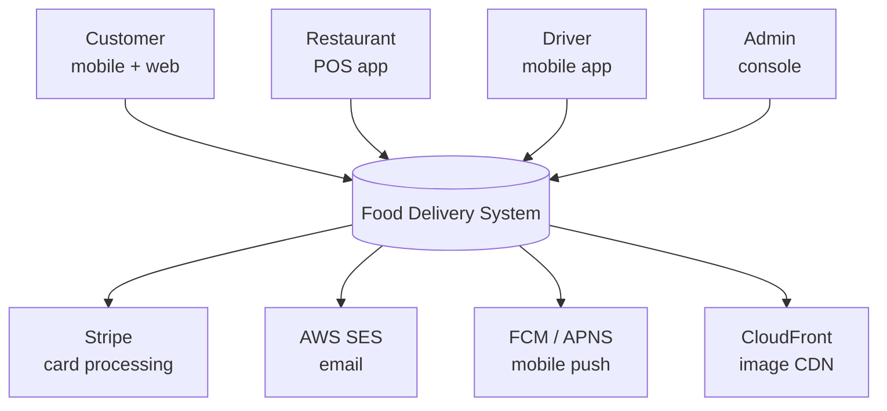
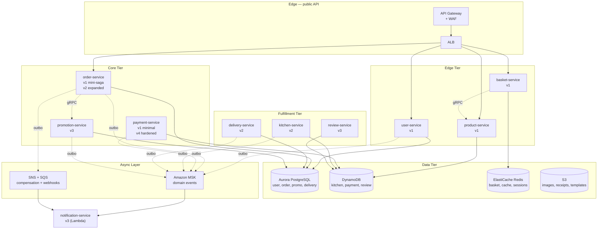
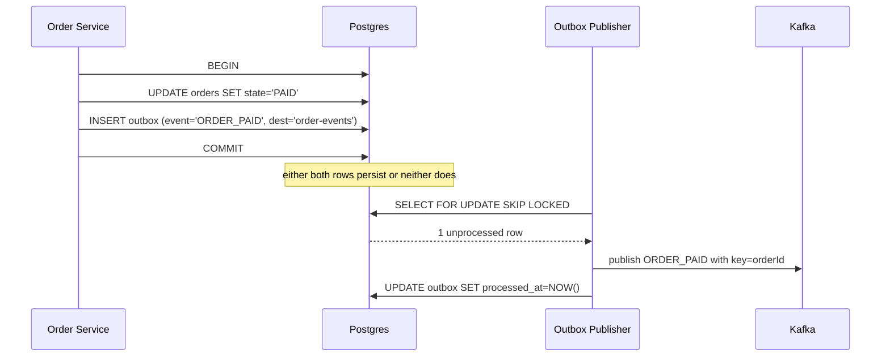
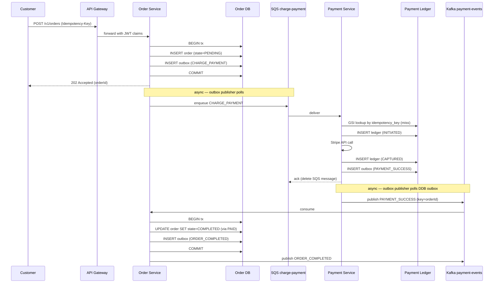
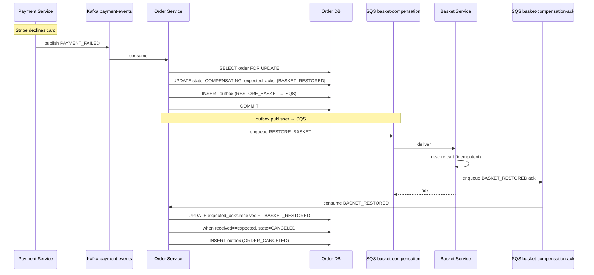

# Food Delivery System — System Design

> **Document purpose**: A single-file system design covering functional and non-functional requirements, capacity estimation, architecture, deep dives on the hard parts, security, scaling, and trade-offs. Companion to `architecture.md` (the design reference) and `build-plan.md` (the implementation steps). This is the **executive layer** — read this to understand the system end-to-end in 30 minutes.

---

## Table of Contents

1. [Overview & Scope](#1-overview--scope)
2. [Functional Requirements](#2-functional-requirements)
3. [Non-Functional Requirements](#3-non-functional-requirements)
4. [Capacity Estimation](#4-capacity-estimation)
5. [High-Level Architecture](#5-high-level-architecture)
6. [Deep Dives — The Interesting Parts](#6-deep-dives--the-interesting-parts)
7. [Critical Path Sequences](#7-critical-path-sequences)
8. [Caching Strategy](#8-caching-strategy)
9. [Load Balancing & Traffic Routing](#9-load-balancing--traffic-routing)
10. [Security & Threat Model](#10-security--threat-model)
11. [Failure Modes & Resilience](#11-failure-modes--resilience)
12. [Scaling Story](#12-scaling-story)
13. [Trade-offs & Alternatives Considered](#13-trade-offs--alternatives-considered)
14. [Open Questions & Risks](#14-open-questions--risks)

---

## 1. Overview & Scope

### What this system is

A multi-tenant food-delivery platform that connects three personas — customers, restaurants, and drivers — through a microservices architecture running on AWS EKS. Customers browse restaurant menus, place orders, and track delivery. Restaurants accept tickets and update preparation status. Drivers claim and complete deliveries.

The platform is **sized for a regional player** — think a top-3 player operating in 2–3 mid-size cities, doing ~36,000 orders/day with 3–4× rush-hour spikes. That's roughly 0.5% of DoorDash's 2024 daily volume (DoorDash processes ~7.1M orders/day across its full market). The architecture is designed to scale 10× from this baseline without structural changes, and 100× with documented additions (Section 12).

### Version structure

The system ships in four versions, each independently deployable to production:

| Version | What it adds | Services after this version |
|---|---|---|
| **v1** | Reference implementation: 5 services + foundation | user, product, basket, payment (minimal), order (mini-saga) |
| **v2** | Restaurant operations | + kitchen, delivery + expanded order saga |
| **v3** | Engagement | + review, promotion, notification |
| **v4** | Payment hardening | payment-service graduates from minimal to full production-grade |

This design document describes the **eventual end-state** (post-v4, all 10 services) with version annotations marking when each piece arrives. See `build-plan.md` for the step-by-step path.

### Out of scope

These are deliberate exclusions to keep the system tractable. Each could be a project in itself:

- **Real-time GPS tracking** of drivers (just status updates, no map).
- **Surge pricing / dynamic pricing**.
- **ML-based recommendations** (search uses simple text + filters).
- **Multi-region active-active deployment** (single-region multi-AZ in v1; multi-region documented as post-v4 work).
- **Self-service restaurant onboarding** (manual operations team for v1–v4).
- **Catering / scheduled orders** (immediate-delivery only).
- **Customer-to-customer features** (no social, no sharing).

---

## 2. Functional Requirements

### 2.1 Customer persona

| ID | Story | Version |
|---|---|---|
| FC-1 | As a customer, I can register with email + password and verify my account | v1 |
| FC-2 | As a customer, I can log in and receive a JWT, and refresh it before expiry | v1 |
| FC-3 | As a customer, I can browse restaurants by location, cuisine, and price range | v1 |
| FC-4 | As a customer, I can view a restaurant's menu with prices and availability | v1 |
| FC-5 | As a customer, I can add items to a cart, with each product entry combining quantities on repeat-add (upsert-by-productId) | v1 |
| FC-6 | As a customer, I can checkout and pay with a credit card via Stripe | v1 |
| FC-7 | As a customer, I can view my order status and history | v1 |
| FC-8 | As a customer, I can cancel my order before kitchen accepts it (v1); or up to delivery start with automatic refund (v4) | v1 → v4 |
| FC-9 | As a customer, I receive real-time push notifications for order status changes | v3 |
| FC-10 | As a customer, I can rate the restaurant, driver, and meal after delivery | v3 |
| FC-11 | As a new customer, I receive a welcome promo code by email | v3 |
| FC-12 | As a customer, I can apply a promo code at checkout | v3 |

### 2.2 Restaurant persona

| ID | Story | Version |
|---|---|---|
| FR-1 | As a restaurant owner, I can manage my menu (CRUD products, prices, hours) | v1 |
| FR-2 | As a restaurant owner, I can upload product images | v1 |
| FR-3 | As a restaurant staffer, I can see incoming tickets in real time | v2 |
| FR-4 | As a restaurant staffer, I can mark tickets through preparation states | v2 |
| FR-5 | When my kitchen is overloaded (configurable threshold), the restaurant is auto-paused in search | v2 |
| FR-6 | As a restaurant owner, I can see aggregate ratings and customer reviews | v3 |

### 2.3 Driver persona

| ID | Story | Version |
|---|---|---|
| FD-1 | As a driver, I can log in and mark myself online/offline | v2 |
| FD-2 | As a driver, I see available delivery tasks broadcast to me | v2 |
| FD-3 | As a driver, I can claim a task; first-come-first-served wins | v2 |
| FD-4 | As a driver, I update my status through pickup → en-route → delivered | v2 |
| FD-5 | As a driver, I can see my earnings history | v2 |

### 2.4 Admin / platform persona

| ID | Story | Version |
|---|---|---|
| FA-1 | Admin can view all orders, filter by status, date, restaurant | v1 |
| FA-2 | Admin can manually transition stuck orders, refund, or cancel | v4 |
| FA-3 | Admin can issue promotional codes to specific cohorts | v3 |

---

## 3. Non-Functional Requirements

### 3.1 Latency SLOs (p99 unless noted)

| Operation | Target | Rationale |
|---|---|---|
| Browse menu (cached) | < 150 ms | Read-heavy; expected to feel instant |
| Browse menu (cache miss) | < 400 ms | Falls through to DDB |
| Login / token refresh | < 500 ms | Includes bcrypt verify; not user-noticeable |
| Add to basket | < 200 ms | Includes gRPC call to product-service |
| Place order (synchronous part) | < 800 ms | Customer waits for 202 Accepted |
| Place order (end-to-end PAID) | < 5 s (p95) | Includes Stripe call; happens async |
| Saga compensation (e2e) | < 30 s | From PAYMENT_FAILED to CANCELED |
| Order list (paginated) | < 300 ms | Aurora read replica |

### 3.2 Availability SLOs

| Surface | Target | Monthly budget |
|---|---|---|
| Ordering path (auth, basket, order, payment) | 99.9% | ~43 min downtime/month |
| Browse path (product) | 99.95% | ~22 min downtime/month |
| Kitchen / driver apps (v2+) | 99.5% | ~3.6 hr downtime/month |
| Notification (v3+) | 99.0% | Email/push are recoverable, lower bar acceptable |

The ordering path's higher availability is because outages directly cost money. The browse path is even higher because most traffic lives there and customers bounce on failures.

### 3.3 Throughput targets (peak — 4× baseline)

| Endpoint family | Baseline | Peak (rush) | Notes |
|---|---|---|---|
| Browse / search reads | 30 req/s | 120 req/s | Cache-fronted, mostly cache hits |
| Login + token refresh | 5 req/s | 20 req/s | Bursty around rush start |
| Basket operations | 8 req/s | 32 req/s | Add/remove items |
| Order placement | 0.42 req/s (1.5k/hr) | 1.67 req/s (6k/hr) | The "1-2k orders/hr + rush" anchor |
| Order status reads | 5 req/s | 25 req/s | Customer + driver + restaurant polling |
| Restaurant ticket reads (v2+) | 2 req/s | 8 req/s | Restaurant POS polling |
| Driver location updates (v2+) | 20 req/s | 80 req/s | Keyed by driverId on Kafka |

### 3.4 Consistency requirements

| Domain | Consistency | Why |
|---|---|---|
| User registration | Strong | No duplicate emails ever |
| Order state machine | Strong (within service) | Idempotent transitions via SELECT FOR UPDATE |
| Payment ledger | Strong (within service) | Financial audit requirement |
| Cross-service order saga | Eventual (~seconds) | Outbox guarantees eventual; saga timeout backstop |
| Product menu | Eventually consistent (~5s) | Cache-aside with 30-min TTL; explicit purge on write |
| Reviews + aggregates | Eventually consistent (~10s) | DDB Streams → aggregate Lambda |

### 3.5 Compliance scope

- **PCI-DSS SAQ-A**: card data never touches our systems (Stripe Elements + tokenization). Payment service stores only Stripe tokens and `last4`.
- **GDPR / data privacy**: PII (email, phone, address) stored in user-service; order address denormalized into order-service for fulfillment. Hard-delete on request, with audit log retained.
- **Audit logging**: every state transition on orders and payments is logged with `traceId`, retained 1 year.

---

## 4. Capacity Estimation

### 4.1 Order volume math

```
Baseline:    1,500 orders/hour = 0.42 orders/sec = 36,000 orders/day
Peak (rush): 6,000 orders/hour = 1.67 orders/sec (sustained 90 min, twice daily)
Annual:      ~13M orders/year
Comparable:  ~0.5% of DoorDash's 2024 volume (DoorDash: 2.6B orders/year = 7.1M/day)
```

Rush windows: lunch (12:00–13:30) and dinner (19:00–20:30). About 70% of daily orders fall in these 3 hours; the remaining 30% spread across the other 21 hours.

### 4.2 Read amplification

Each order generates roughly 25 read operations across its lifecycle:
- 10–15 menu browse views (the customer shops around)
- 5–10 basket operations (add, remove, view)
- 3–5 order status checks (after placing)
- Plus background polling from restaurant POS and driver app

**Peak read load**: 6,000 orders/hour × 25 reads = 150,000 reads/hour = ~42 reads/sec. Browse-without-ordering doubles this to ~85 reads/sec peak.

### 4.3 Storage growth

| Store | Per-order size | Annual growth |
|---|---|---|
| Postgres (orders + outbox + items) | ~2 KB | 26 GB/year |
| DynamoDB payment-ledger | ~3 KB (3 entries × 1 KB) | 39 GB/year |
| DynamoDB reviews (v3) | ~1 KB (50% reviewed) | 7 GB/year |
| Kafka topics (14-day retention) | ~5 KB events/order | 12 GB live data steady-state |
| S3 receipts (v3) | ~50 KB PDF | 600 GB/year |
| S3 product images | ~200 KB × 100k images (cumulative) | ~20 GB total |

**Total stateful data after year 1**: ~100 GB hot + 600 GB cold (receipts). After year 3: ~300 GB hot + 1.8 TB cold. Comfortably within Aurora Serverless v2 and DDB on-demand pricing tiers.

### 4.4 Kafka partition sizing

| Topic | Partitions | Reasoning |
|---|---|---|
| `user-events` | 3 staging / 6 prod | Low rate, even distribution by userId |
| `order-events` | 6 staging / 12 prod | Peak 1.67 orders/sec × 4 events/order = 7 events/sec. 12 partitions gives 0.6 events/sec/partition with headroom for 10× growth |
| `payment-events` | 3 staging / 6 prod | Same rate as orders but fewer events |
| `kitchen-events` (v2) | 3 / 6 | Bounded by restaurant count (3k) |
| `delivery-events` (v2) | 3 / 6 | Bounded by active driver count |
| `driver-status` (v2) | 12 / 12 | Per-driver ordering required; high cardinality |
| `promotion-events` (v3) | 3 / 3 | Low rate |

The key Kafka design rule applied: partition count = **headroom for per-key ordering**, not raw throughput. We're nowhere near MSK throughput limits at this scale.

### 4.5 Database connection sizing

Order-service example (highest criticality):
- 4 pods in production × 20 connections each = 80 connections
- Aurora `max_connections` for `db.r6g.large`: ~270
- Headroom: 70% (270 - 80 = 190 connections free for ops + read replicas)

HikariCP per-pod config: `maximumPoolSize=20`, `minimumIdle=5`, `connectionTimeout=2000ms`.

### 4.6 Approximate monthly AWS cost (v1, production)

| Service | Monthly cost |
|---|---|
| EKS Fargate (5 services × ~4 pods × 0.5 vCPU/1GB avg) | ~$350 |
| Aurora Serverless v2 (2 ACU avg) | ~$400 |
| DynamoDB on-demand (~50 GB, modest RCU/WCU) | ~$100 |
| ElastiCache Redis (cache.t4g.small × 2 nodes) | ~$70 |
| MSK Serverless (low throughput tier) | ~$200 |
| ALB + API Gateway + data transfer | ~$150 |
| CloudWatch + Managed Prometheus + Grafana | ~$120 |
| S3 + CloudFront | ~$50 |
| Misc (CodeBuild minutes, NAT, Route53, KMS, Secrets) | ~$200 |
| **Total v1 production** | **~$1,640/month** |

Staging is ~40% of this. v2/v3/v4 each add ~$200–400/month. Production cost per order at v1 baseline: ~$0.06.

---

## 5. High-Level Architecture

### 5.1 C4 Context diagram



### 5.2 C4 Container diagram (the 10 services)



### 5.3 Communication patterns at a glance

| From → To | Protocol | When |
|---|---|---|
| Client → API Gateway | HTTPS REST | All public traffic |
| API Gateway → service | HTTP via VPC link | Routed by path |
| basket → product | gRPC | Verify item availability + price (sync, in basket-add hot path) |
| order → promotion (v3) | gRPC | Validate promo code (sync, in checkout) |
| order → payment | SQS command | Async: write `CHARGE_PAYMENT` to outbox → SQS |
| payment → order | Kafka event | Async: emit `PAYMENT_SUCCESS` / `PAYMENT_FAILED` |
| order → basket (compensation) | SQS command | Async: write `RESTORE_BASKET` to outbox → SQS `basket-compensation` queue |
| basket → order (compensation ack) | SQS ack | Async: enqueue `BASKET_RESTORED` ack on `basket-compensation-ack` queue |
| user → consumers (v3) | Kafka event | Async: `USER_CREATED` consumed by promotion + notification |

**Rule of thumb applied throughout**: gRPC only when the caller blocks on the response and latency matters. Everything else is async via outbox + Kafka (for events) or outbox + SQS (for point-to-point commands).

---

## 6. Deep Dives — The Interesting Parts

### 6.1 The Saga + Outbox Pattern

**Problem**: placing an order spans multiple services (basket, payment, kitchen, delivery). There's no distributed two-phase commit across HTTP and message queues. If payment succeeds but the order record fails to write, the customer is charged for nothing. If the order writes but the payment event never reaches the kitchen, the customer paid but no food is made. Without coordination, partial failures corrupt state silently.

**Solution**: a **saga orchestrated by order-service**, where each step is a local DB transaction, and each forward step has a defined compensating step. Reliability of cross-service messaging is guaranteed by the **transactional outbox pattern**.

**The outbox guarantee**: any state change and the events it produces are written in **one DB transaction**. A separate publisher polls the outbox table and publishes to MSK / SQS, marking rows processed.



**Why this works**:
- If the publisher crashes after publishing but before marking processed, the row is republished — consumers handle this via idempotency.
- Multiple publisher pods can run concurrently; `SELECT FOR UPDATE SKIP LOCKED` prevents duplicate work.
- The DB commit is the **single source of truth**: if the outbox row exists, the event WILL eventually publish.

**The saga state machine (v1 mini-saga, 6 states)**:

```
PENDING ──[PAYMENT_SUCCESS]──▶ PAID ──[auto]──▶ COMPLETED (terminal)
   │
   ├──[PAYMENT_FAILED]──▶ COMPENSATING ──[BASKET_RESTORED]──▶ CANCELED (terminal)
   │
   └──[SAGA_TIMEOUT]──▶ COMPENSATING ──[BASKET_RESTORED]──▶ FAILED (terminal)
```

v1 demonstrates the saga pattern on a small surface (1 compensation action). v2 expands to 10 states with kitchen + delivery transitions and 3 compensation actions. The pattern is the same; only the state count grows.

**Saga timeout enforcer**: a scheduled task runs every 30 seconds, queries for orders in non-terminal states with no progress past per-state thresholds (`PENDING → 2min`, `COMPENSATING → 5min`), and triggers compensation as if a failure event arrived. **This is the safety net.** It guarantees no order stays stuck forever, regardless of what messages get lost or which consumers crash.

**Why orchestration, not choreography**: with 5+ services participating in the v2 expanded saga, choreography (each service reacts to others' events) becomes hard to reason about. Orchestration centralizes the state machine in order-service — there's one place to see the full flow, one place to add timeouts, one place to add new compensation paths. Trade-off: order-service becomes a critical dependency. Mitigated by running 4 replicas and treating it as the highest-criticality service.

### 6.2 Hybrid Messaging — Kafka for Events, SQS for Commands

The async layer mixes Amazon MSK (Kafka) and SNS+SQS deliberately. Each serves a different purpose, and getting them confused leads to wrong choices.

**Kafka topics carry domain events** — facts about what happened (`USER_CREATED`, `ORDER_PAID`, `PAYMENT_FAILED`). Events are:
- **Replayable**: a new consumer can start from earliest offset and catch up history. Useful when adding new services (v3's promotion-service consumes `USER_CREATED` events emitted since v1 — those events are still in Kafka).
- **Multi-consumer**: multiple services subscribe to the same topic via independent consumer groups. `ORDER_PAID` in v2+ is consumed by kitchen, notification, and analytics independently.
- **Per-key ordered**: events for the same `orderId` arrive in order within the partition, important for state machines.

**SQS queues carry point-to-point commands and compensation acks** — instructions to do something (`CHARGE_PAYMENT`, `RESTORE_BASKET`, `CANCEL_KITCHEN_TICKET`) and single-recipient acknowledgements of those commands (`BASKET_RESTORED`). Commands and acks are:
- **Single-consumer**: one service is the intended recipient. SQS deletes after ack.
- **Not replayable**: replaying "cancel this ticket" tomorrow would be wrong.
- **Time-bound**: commands have implicit expiry; events are facts forever.

**The decision rule applied**: if more than one service might care, or if replay has value, use Kafka. Otherwise SQS.

**Stripe webhook intake (v4) uses SNS+SQS** because public-facing webhook endpoints need a buffer. API Gateway → SNS → SQS → payment-service consumer. If payment-service is down, SQS retains messages until it recovers. Kafka would work but the cross-zone replication and ordering guarantees aren't needed for what's essentially a fan-in pattern.

### 6.3 Payment Idempotency

**Problem**: charging a customer's card twice is a critical bug. Network timeouts mean we sometimes don't know if a Stripe API call succeeded. Retrying without idempotency = double-charge.

**Solution**: every charge request carries an idempotency key (the order ID). Before calling Stripe, payment-service does a conditional read against DynamoDB; if a ledger entry with that key exists, return the prior result without re-charging.

**Ledger schema** (DynamoDB):

| Field | Type | Notes |
|---|---|---|
| `payment_intent_id` | PK | Stripe payment intent ID |
| `entry_seq` | SK | Monotonic per intent |
| `entry_type` | string | INITIATED, AUTHORIZED, CAPTURED, FAILED, REFUNDED, DISPUTED |
| `idempotency_key` | GSI key | The order ID; used for duplicate detection |
| `amount` | number | Cents |
| `currency` | string | ISO 4217 |
| `stripe_response` | JSON | Full response for audit |
| `created_at` | timestamp | |

**Append-only**: every entry is a `PutItem` with `ConditionExpression = "attribute_not_exists(entry_seq)"`. The ledger is the source of truth for financial reconciliation.

**Stripe also dedups**: the Stripe API takes an `Idempotency-Key` header. Even if our application logic has a bug and tries to charge twice, Stripe's server-side dedup catches it.

**Three-layer defense**:
1. Application-layer idempotency check (DDB GSI lookup before charge).
2. Stripe-side idempotency (HTTP header).
3. SQS-level deduplication on the `charge-payment` queue (within the 5-min dedup window).

A double-charge bug requires breaking all three layers simultaneously — vanishingly unlikely.

### 6.4 Polyglot Persistence — Why Different DBs

Different services use different databases because their access patterns differ enough that one-size-fits-all costs more than it saves.

**PostgreSQL (Aurora) for**: user, order, promotion, delivery. These need:
- ACID transactions (outbox pattern requires writing state + event atomically).
- Joins (order → order_items, user → roles).
- Unique constraints (one email, one promo per user per type).
- Row-level locking (`SELECT FOR UPDATE NOWAIT` for delivery's claim race).
- Read replicas for reporting / order history.

PostgreSQL is the only realistic option for these patterns. DynamoDB would force application-layer joins and approximate atomicity via transactional writes (limited to 100 items, 25 in v1).

**DynamoDB for**: kitchen, payment-ledger, review. These need:
- Single-key access dominant (kitchen: `GetItem(restaurantId)` returns active tickets; payment: `GetItem(paymentIntentId)` returns ledger entries).
- High write throughput with predictable latency (atomic counter for kitchen capacity).
- Flexible schemas (review fields differ across restaurant/driver/meal).
- On-demand billing for unpredictable workloads (lunch-rush spikes don't require capacity planning).

**Product uses Aurora PostgreSQL** (same cluster as user, order, delivery, promotion) because: the access pattern includes full-text search and category filtering (not single-key lookups); `@Version` optimistic locking cleanly handles concurrent stock updates; the service was built with JPA/Hibernate and works correctly — no DynamoDB advantage justifies a rewrite.

DynamoDB also gives us DDB Streams for outbox publishing (kitchen, payment v4), avoiding a separate publisher process.

**Redis for**: basket (primary store, not cache), product cache, session/refresh tokens, rate-limit counters. Carts are transient — Redis Cluster Mode gives durability without the operational weight of a "real" database.

**Trade-off accepted**: operating 3 storage technologies (Aurora, DDB, Redis) is more complex than one. The complexity is justified because the access patterns genuinely differ, and forcing them into one DB would either cap scaling (Postgres for everything → hot-key problems at lunch rush) or force bad workarounds (DynamoDB for everything → application-layer joins for order history queries).

---

## 7. Critical Path Sequences

### 7.1 Order placement — happy path (v1)



The customer gets 202 Accepted in <800ms (Section 3.1). Payment completes async over the next 1–5 seconds. The client polls `GET /v1/orders/{id}` or receives a push notification (v3+) for the final state.

### 7.2 Order placement — payment fails



Two key properties on display:
1. **Compensation is event-driven, not RPC-driven**. Order-service doesn't call basket-service directly; it writes a command to SQS via outbox. If basket-service is down, the command waits in SQS.
2. **Each ack is tracked**. The `expected_acks` JSONB column accumulates received acks. The saga progresses only when all expected acks land. In v1 there's one ack; in v2 (after kitchen) there can be 2–3.

---

## 8. Caching Strategy

### 8.1 Caches in the system

| Cache | Pattern | TTL | Invalidation |
|---|---|---|---|
| Product menu (Redis) | Cache-aside | 30 min | Explicit purge on menu write |
| JWT public key (Parameter Store + in-process) | Read-through | 24 hr | Manual rotation |
| Refresh tokens (Redis) | Primary store | 30 days | On logout / rotation |
| Rate-limit counters (Redis) | Primary store | 1 min sliding | Auto-expire |
| Idempotency keys (Redis prefix `idem:`) | Primary store | 24 hr | Auto-expire |
| Basket (Redis) | Primary store, not cache | 24 hr | Auto-expire / explicit clear on checkout |

### 8.2 Cache-aside for product menu

```
read: redis.get(key) → if hit, return
                    → if miss, ddb.get_item, redis.set(key, val, ttl=30min), return
write: ddb.put_item → redis.del(affected_keys)
```

**Key design**: `product:v2:restaurant:42` — the `v2` is a global version. A deploy can invalidate all caches at once by bumping the version, without iterating keys.

**Hit-rate SLO**: > 90% during steady state, > 80% during deploys (when fresh pods miss for the first ~30s). Hit rate is itself an alert-worthy metric — below 80% means TTLs are wrong or warming is broken.

### 8.3 Why Redis primary for basket, not cache

Basket data is transient — losing a cart due to TTL expiry is acceptable user experience. But losing a cart due to Redis instance failure mid-shopping is not. Redis Cluster Mode (3 shards, replicas per shard) gives the durability we need without the operational cost of "real" durable storage. The trade-off: if all replicas of a shard fail simultaneously (rare), some carts are lost. Customers re-add and continue. Better than persisting carts to Postgres and paying the latency cost on every add.

### 8.4 What we don't cache

- **Order state**: state changes frequently, cache invalidation is hard, and the source of truth (Postgres with read replicas) handles peak load fine.
- **Payment ledger**: too sensitive; correctness over speed.
- **User profile**: low read rate; not worth the invalidation complexity.

---

## 9. Load Balancing & Traffic Routing

### 9.1 Two-layer routing

```
Client → CloudFront (static assets only)
       → API Gateway (JWT validation, rate limiting, WAF) → ALB → EKS pod
```

**API Gateway** does the work that belongs at the edge:
- JWT signature validation (HS256 / RS256, public key from Parameter Store)
- Per-route rate limiting (e.g., 5 req/sec/IP on `/v1/auth/login` to throttle credential stuffing)
- Request validation against JSON schema (rejected at edge before reaching pods)
- AWS WAF rules (SQL injection, XSS, common CVEs, geo-blocking)

**ALB** does L7 routing across services in the VPC:
- Path-based: `/v1/orders/**` → order-service target group
- Active health checks at `/actuator/health/readiness`
- Slow-start on new targets (5 min ramp) to avoid stampeding fresh pods

### 9.2 Within-service load balancing

EKS Service objects use `ClusterIP` with Kubernetes default round-robin. For HTTP keep-alive flows, this can lead to uneven distribution; mitigated by:
- Short connection lifetimes (15 min `Connection-Lifetime` header from ALB)
- Resilience4j bulkheads per upstream, so one slow pod doesn't drown the cluster

### 9.3 Rate limiting strategy

Three layers:
1. **Edge (API Gateway)**: per-IP. Blocks bot floods before they reach the cluster.
2. **Service (Resilience4j)**: per-route. Protects downstream services from runaway clients (e.g., a buggy mobile build).
3. **User (Redis sliding window)**: per-user. Prevents abuse — 100 basket-add requests per minute per user is plenty for legitimate use.

Limits are configured to allow rush-hour traffic comfortably. The point is to catch abuse, not to throttle legitimate users.

---

## 10. Security & Threat Model

### 10.1 Trust boundaries

```
[Internet] ──→ [API Gateway + WAF] ──→ [VPC] ──→ [EKS pods] ──→ [Data tier]
   untrusted        edge boundary       trusted        trusted        trusted
```

Every cross-boundary call is authenticated and authorized:
- Internet → API Gateway: TLS 1.3, optional client cert for B2B partners (out of scope for v1).
- API Gateway → ALB: VPC link, TLS terminated at ALB.
- Pod → Pod: NetworkPolicy whitelist; mTLS via service mesh (post-v4).
- Pod → AWS service: IRSA-bound IAM role with least-privilege policy.

### 10.2 STRIDE-lite per tier

| Tier | Spoofing | Tampering | Repudiation | Info Disclosure | DoS | Elevation |
|---|---|---|---|---|---|---|
| **Edge** | WAF + IP rate limit | TLS 1.3, request signing for webhooks | All requests logged with `traceId` | TLS in transit, no PII in URLs | API Gateway throttling | n/a |
| **Auth** | JWT signature verify, refresh rotation | JWT claims signed | Auth events to audit log | Argon2id hashes, never log passwords | Login rate limit (5/IP/min) | Role claim in JWT, verified per request |
| **Core (order, payment)** | mTLS planned post-v4 | Idempotency keys prevent replay | Append-only payment ledger | KMS encryption at rest | Bulkheads isolate hot paths | IRSA least privilege |
| **Data** | Connection auth (Secrets Manager) | Backups + PITR | Audit log on every write | Encryption at rest, VPC endpoints | Connection pool limits | DB users per service |

### 10.3 Secrets handling

- **AWS Secrets Manager** for DB passwords, Stripe API keys, JWT private keys.
- **External Secrets Operator** syncs Secrets Manager → Kubernetes Secrets → pod env vars.
- **30-day auto-rotation** on DB passwords (Aurora native), 90-day rotation on Stripe keys (manual).
- **No long-lived AWS credentials anywhere**. CodeBuild uses execution role; pods use IRSA.
- **Secret access is audited**: CloudTrail logs every Secrets Manager read.

### 10.4 PCI-DSS scope

We're SAQ-A — the simplest PCI level — because card data never enters our environment:
- Customer enters card in Stripe Elements (Stripe-hosted iframe, on their domain).
- Stripe returns a token to our frontend.
- Frontend POSTs the token to payment-service.
- We store the token + `last4`. Never the PAN.

This keeps PCI scope to just the payment-service pod's network boundary, which significantly reduces audit cost.

### 10.5 PII scope

PII (email, phone, delivery address) is bounded to:
- **user-service**: email, phone, password hash, registered addresses.
- **order-service**: delivery address denormalized into the order (needed for fulfillment).
- **notification-service**: email/phone passed in event payload, used once for sending.

**GDPR right-to-deletion**: a user requesting deletion triggers a soft-delete in user-service, an anonymization in order-service (replace address with `[REDACTED]` but keep order for tax reconciliation), and a hard-delete in notification's idempotency table.

---

## 11. Failure Modes & Resilience

### 11.1 What breaks when X is down

| Failure | Impact | Mitigation | Recovery |
|---|---|---|---|
| **MSK cluster down** | New events can't publish; saga progression halts | Outbox rows accumulate; publisher retries | When MSK returns, publisher drains backlog. Customer-facing latency unaffected for sync paths. |
| **RDS Aurora primary down** | Auth, order writes, promo writes fail | Aurora failover ~30s to replica | After failover, writes resume. Read traffic was on replica anyway. |
| **DynamoDB throttled** | Product reads slow; cache absorbs most | Cache-aside; auto-scaling on-demand | Throttles clear within seconds at DDB scale we run at |
| **Redis cluster down** | Basket lost, sessions invalidated | Pods retry briefly; users see "session expired" | Redis recovers; users re-login |
| **Stripe API down** | Payments queue up in SQS | Order-service keeps accepting orders, saga waits | When Stripe returns, payment-service drains queue. Customers see "payment processing" longer. |
| **Single pod crash** | Lost in-flight requests for that pod | K8s replaces pod within ~30s; HPA scales | Other replicas absorb load |
| **AZ outage** | One-third of pods unavailable | Multi-AZ deployment; remaining pods carry load | EKS reschedules into healthy AZs |
| **Saga consumer crash mid-flow** | Order stuck in non-terminal state | Saga timeout enforcer triggers compensation at threshold | Order reaches FAILED state cleanly |

### 11.2 Resilience patterns in use

- **Outbox**: guarantees event delivery despite service crashes.
- **Idempotent consumers**: at-least-once delivery → must be safe to process twice.
- **Saga timeout enforcer**: backstop for any stuck order, regardless of root cause.
- **Circuit breakers (Resilience4j)**: prevent cascading failures. If Stripe is slow, the circuit opens after 50% failures in 20 calls, and order-service shows "payment unavailable" instead of timing out 100 requests in a row.
- **Bulkheads**: isolate charge calls from refund calls in payment-service (v4) — a slow refund queue can't starve charges.
- **Retries with exponential backoff and jitter**: 3 attempts max, retried only for idempotent operations.
- **Health checks**: liveness vs readiness distinguished. Readiness drops a pod from the LB pool during slow startup; liveness restarts a wedged pod.

### 11.3 Chaos engineering plan

Once v1 is in production for 30 days with stable SLOs, run AWS Fault Injection Simulator scenarios in staging weekly:

| Scenario | Expected behavior |
|---|---|
| Kill 1 of 4 order-service pods | HPA scales replacement within 60s; no order failures |
| Inject 500ms latency on basket → product gRPC | Circuit breaker trips; basket-add returns "menu temporarily unavailable" with cached fallback |
| Network partition between order-service and MSK for 2 min | Outbox rows accumulate; on partition heal, all backlog flushes in <30s |
| Force RDS failover during peak | <30s of write unavailability; orders queue at API Gateway, no data loss |
| Throttle DDB to 10 RPS | Cache absorbs reads; writes fail with retry → eventually succeed |

---

## 12. Scaling Story

### 12.1 Today (v1 production peak: 6k orders/hour)

Comfortable at current capacity. Bottlenecks observed only during simulated 10× load tests.

### 12.2 10× (60k orders/hour peak, ~530k orders/day)

What changes:
- **Aurora**: scale to db.r6g.2xlarge (4× vCPU). Read replicas: 2 → 4.
- **EKS**: pod counts double for order, payment, basket. HPA auto-scales most of this.
- **MSK**: order-events partitions 12 → 24 (re-partition without downtime).
- **Redis**: cluster shards 2 → 4.
- **Estimated cost**: ~$8k/month (5× from baseline, sub-linear due to per-resource economies).

No architectural changes needed. The plan supports this growth.

### 12.3 100× (600k orders/hour peak, ~5M orders/day — DoorDash scale)

What changes:
- **Order-service** can no longer be a single deployment — partition by region (us-east, us-west, eu-central). Each has its own DB, Kafka cluster, Order Service deployment. Cross-region orders are rare and routed by user's region.
- **Read models / CQRS**: a separate "order-read" service backed by OpenSearch syncs from Kafka, serving the customer order-history endpoint independently from the write side. Reduces load on Aurora replicas.
- **Geo-partitioned DynamoDB**: global tables for product (read-heavy) and reviews. Single-region writes still acceptable for payment-ledger.
- **Multi-region active-active** for the user-facing edge (API Gateway, CloudFront, Cognito for auth). Route 53 latency-based routing.
- **Estimated cost**: ~$100k/month, but per-order cost holds at ~$0.05 due to economies of scale.

Architectural changes required: regional partitioning, CQRS read models, multi-region. Each is significant work; documented as "post-v4 evolution."

### 12.4 Bottlenecks by tier

| Tier | First bottleneck (in order) | At approximate scale |
|---|---|---|
| Edge | API Gateway throttle limits per account | 10k req/s — quota increase available |
| Compute | Aurora connection pool exhaustion | When pod count outgrows connections |
| Sync messaging | gRPC connection pool to product-service | Mitigated by Resilience4j + HPA |
| Async messaging | MSK partition rebalance latency | Pre-emptive partitioning before incidents |
| Data | DDB hot partition for product reads | Mitigated by cache; if cache miss rate spikes, add read replica region |

---

## 13. Trade-offs & Alternatives Considered

| Decision | Chosen | Alternative | Why chosen |
|---|---|---|---|
| **Service granularity** | 10 microservices | Monolith / 3 macroservices | Bounded contexts are real (kitchen, delivery, payment evolve at different rates). Cost: operational complexity, mitigated by shared platform. Could start monolith but the refactor cost later is higher than the upfront cost now. |
| **Saga style** | Orchestration (order-service is leader) | Choreography (services react to events) | With 5+ services in v2 saga, choreography becomes hard to reason about. One state machine in one place wins on debuggability. Cost: order-service is critical — mitigated by 4 replicas and treating it as highest tier. |
| **Async messaging** | Hybrid: Kafka + SNS/SQS | Kafka-only / SQS-only | Kafka-only: SQS-style point-to-point commands abuse Kafka semantics (every consumer sees the message). SQS-only: lose replay capability for events. Hybrid is the cost of using each tool right. |
| **Data stores** | Postgres + DynamoDB + Redis | Postgres-only / DynamoDB-only | Postgres for everything: hot-key problems on product reads at lunch rush. DynamoDB for everything: application-layer joins for order history. Polyglot is the cost of access patterns differing meaningfully. |
| **Payment in v1** | Minimal (Stripe test mode, no webhooks, no refunds) | Full payment service from v1 | v1's purpose is the reference implementation. Adding webhooks, refunds, full Resilience4j stack in v1 = +3 weeks of work for features that don't change v1's architectural lessons. Graduates to full in v4. |
| **CI/CD** | AWS-native (CodePipeline, CodeBuild, ArgoCD) | GitHub Actions | Single-cloud story: no cross-account credential management, IRSA works everywhere. Cost: more verbose pipeline definitions; mitigated by Terraform modules. |
| **Versioning approach** | Build in 4 shippable versions | Big-bang full system | Each version is independently shippable; reduces risk that the platform never reaches production. v1 alone is a real product. |
| **JWT** | Self-validated (RS256) | Token introspection per request | Self-validation: ~0.5ms per request, no cross-service call. Introspection: 1 round-trip per request to auth-service. Self-validation wins at every scale we care about. Cost: revocation requires cache invalidation; mitigated by 15-min access token lifetime. |
| **K8s manifest delivery** | GitOps (ArgoCD watches separate repo) | Direct `kubectl apply` from CI | GitOps gives audit trail, easy rollback, drift detection. Cost: extra repo to maintain; mitigated by clear repo split (code vs manifests). |
| **Single AWS account** | Single account with strict tagging for v1 | Multi-account from day one | Multi-account is correct long-term but adds Terraform complexity early. Single-account-with-tags is sufficient for v1; v4+ migration to multi-account is documented as future work. |

---

## 14. Open Questions & Risks

### 14.1 Things to validate during v1

| Question | How to answer |
|---|---|
| Is MSK Serverless pricing acceptable at our throughput? | Measure during v1 staging. Switch to MSK Provisioned if Serverless exceeds $300/mo. |
| Does Aurora Serverless v2 ramp fast enough for rush onset? | Load-test the lunch-rush ramp in staging. Set min ACU to absorb the ramp lag if needed. |
| Is the outbox polling lag (~500ms) acceptable end-to-end? | Measure saga e2e latency under load. Move to DDB Streams (kitchen, payment v4) or Debezium CDC (post-v4) if needed. |
| Does the saga timeout enforcer scale linearly? | Once order count hits 100k active in non-terminal states, profile the scan query. Add index if needed. |

### 14.2 Known limitations of v1 (deliberately deferred)

- **No refund flow in v1.** Cancellation only works before payment completes. Customers contact support for post-payment cancellation. Fixed in v4.
- **No webhook handling in v1.** Stripe events that arrive after the synchronous response (delayed declines, chargebacks) are not processed. Fixed in v4.
- **No real notifications in v1.** Welcome email, status pushes, receipt PDFs all wait for v3. v1 customers get HTTP responses only.
- **No real kitchen workflow.** v1's "order COMPLETED" terminal state stands in for what v2 will call "DELIVERED." Real restaurants and drivers come in v2.
- **No promotional codes.** Total = subtotal in v1. Promo logic ships with v3.

### 14.3 Risks to mitigate

| Risk | Mitigation |
|---|---|
| Outbox publisher lag spikes during DB load | Monitor `outbox_lag` metric per service; alert if > 10s for 5 min |
| Saga gets stuck due to missed acks | Saga timeout enforcer + alert on `orders_stuck > 0 for 30 min` |
| Stripe webhook signature failures (v4) | Detailed logging; alert on > 1% rejection rate |
| Cache stampede on product menu after deploy | Random TTL jitter (±10%); cache warming script |
| Hot restaurant ID in DDB at viral lunch | DDB on-demand autoscales; if hot key sustained, add read replica region |
| Compromised CodeBuild service role | Per-service-pipeline roles with minimum permissions; CloudTrail alerting on suspicious API calls |

### 14.4 Post-v4 evolution candidates

- **Debezium CDC** to replace per-service outbox polling with shared MSK Connect cluster.
- **OpenSearch read models** for order history at 10×+ scale (CQRS).
- **Multi-region active-active** for global scale.
- **Service mesh (Istio)** for mTLS, traffic shifting, deeper observability.
- **Real-time GPS tracking** for delivery.
- **Surge pricing** via a new pricing-service.
- **ML-based search ranking** for product-service.

---

## Document references

- **`ARCHITECTURE.md`** — design reference, deeper detail on each service and pattern.
- **`BUILD-PLAN.md`** — the 98 implementation steps across 21 phases, organized as v1/v2/v3/v4.

This system design sits above both. It tells you *what* the system is and *why* the major decisions were made. The other two docs tell you *how* it's structured and *how to build it*.